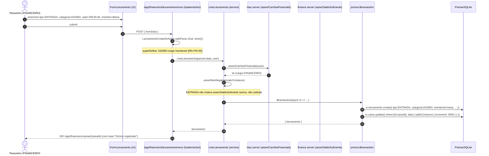
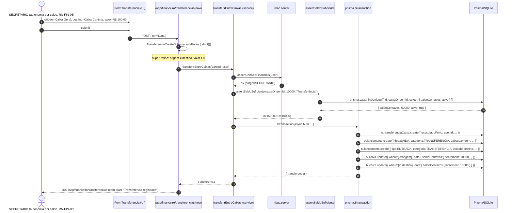
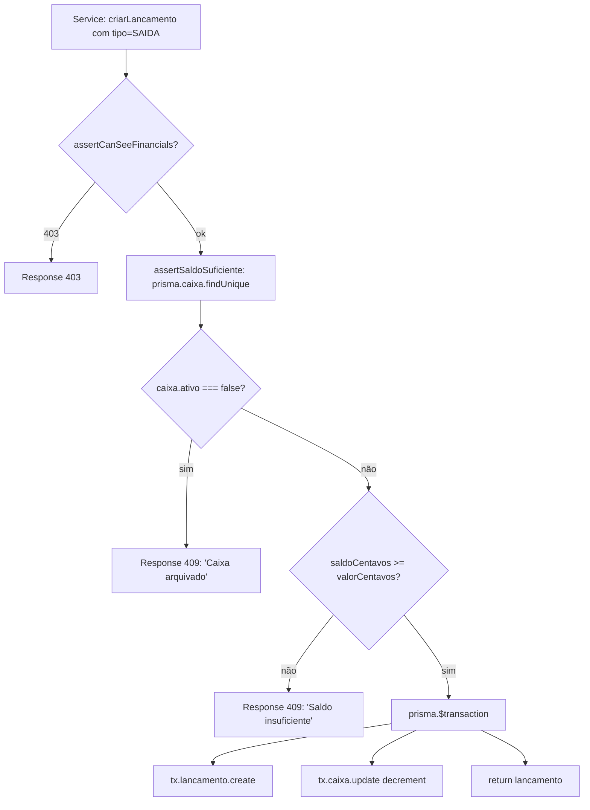
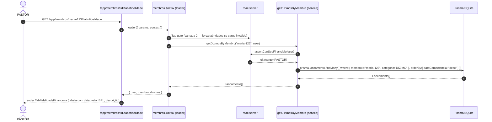
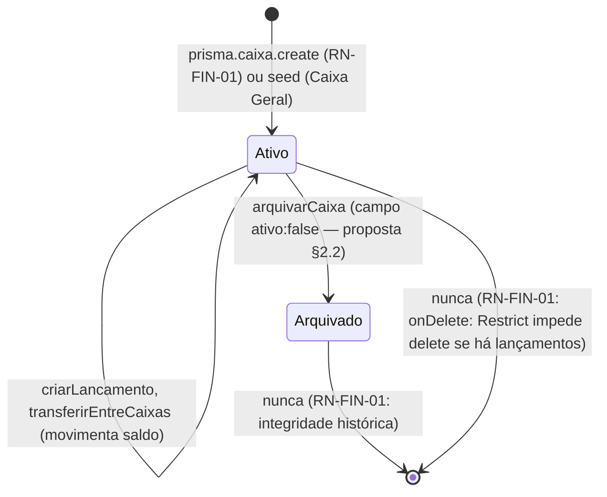

## 1. Contexto

O **Módulo Financeiro** é o **escopo único** do **ciclo 2** do Harness v6. É a primeira vertical de negócio a ser entregue **após** o MVP (Auth + Membros + Discipulado + Alertas + Acolhimento, ciclo 1, S00-S05 fechados com 905 testes e 88,21% de cobertura). Toda a infraestrutura crítica já existe:

- **Schema Prisma** com 3 models (`Caixa`, `TransferenciaCaixa`, `Lancamento`) + 2 enums (`TipoLancamento`, `CategoriaLancamento` com 7 valores).
- **2 RAGs não-negociáveis** já aprovados: `security-rbac-matrix` (RBAC) e `convention-monetary-values` (centavos).
- **Service `getDizimosByMembro`** já em `app/lib/finance.server.ts` com a Camada 3 RBAC (`assertCanSeeFinancials`) pronta — basta remover o stub e descomentar a query real.
- **Componente `TabFidelidadeFinanceira`** já existe na ficha do membro, restrito aos perfis `ADMIN`, `PASTOR`, `FINANCEIRO` (RN-MEM-03), em formato placeholder aguardando dados reais.
- **6 perfis RBAC** já com matriz canônica; matriz do módulo financeiro é uma **extensão** da existente.

O propósito do ciclo 2 é **executar o que a Fase 0 já planejou**, sem expansão de requisitos não-ditos. Não há nova decisão arquitetural macro a tomar — toda decisão de modelagem, segurança, dinheiro e RBAC já foi tomada. Este RAG documenta **como as peças se conectam**, **quais serviços existem**, **quais fluxos críticos passam pelo módulo**, e **onde mora cada regra de negócio (RN-FIN-01 a 05)**.

> **Princípio-guia do ciclo 2 (do brief §1):** *"Não há nova decisão arquitetural a tomar — toda decisão de modelagem, segurança, dinheiro e RBAC já foi tomada. O custo deste ciclo é executar o que está planejado, não arquitetar."*

## 2. Decisão / Regra — Camadas e fronteiras

O Módulo Financeiro segue a **mesma arquitetura monolítica modular** do MVP (RAG `architecture-monolith-modular`), com **5 camadas** e a regra de dependência estrita:

```
Apresentação → Aplicação (router) → Domínio (services) → Infra (lib) → Dados (Prisma)
```

**Estrutura de pastas adicionada pelo ciclo 2** (nada colide com ciclo 1):

```
app/
├── lib/
│   ├── finance.server.ts              # helpers: assertSaldoSuficiente, getDizimosByMembro
│   ├── caixas.server.ts               # CRUD Caixa (listar, criar, editar, arquivar)
│   ├── lancamentos.server.ts          # CRUD Lancamento (criar, listarPorCaixa, listarPorMembro)
│   ├── transferencias.server.ts       # transferirEntreCaixas
│   ├── money.server.ts                # formatBRLFromCents, parseBRLToCents, assertNonNegative (JÁ EXISTE)
│   ├── rbac.server.ts                 # assertCanSeeFinancials, assertCanManageCaixa (NOVO helper)
│   ├── errors.ts                      # DomainError, BusinessRuleError (JÁ EXISTE)
│   └── schemas/
│       ├── caixas.ts                  # CaixaCreateSchema, CaixaUpdateSchema
│       ├── lancamentos.ts             # LancamentoCreateSchema (com superRefine RN-FIN-05)
│       └── transferencias.ts          # TransferenciaCreateSchema (com superRefine origem≠destino)
├── routes/app/
│   ├── financeiro._index.tsx          # dashboard (cards de saldo por caixa + indicador agregado)
│   ├── financeiro.caixas._index.tsx   # listagem de caixas
│   ├── financeiro.caixas.novo.tsx     # criar caixa
│   ├── financeiro.caixas.$id.tsx      # extrato do caixa + arquivar
│   ├── financeiro.lancamentos.novo.tsx# criar lançamento (com campo "Membro" condicional)
│   ├── financeiro.transferencias._index.tsx  # listagem (somente leitura)
│   └── financeiro.transferencias.novo.tsx   # form de transferência
└── components/
    ├── FormCaixa.tsx                  # criar/editar
    ├── FormLancamento.tsx             # criar (com campo Membro condicional à categoria)
    ├── FormTransferencia.tsx          # origem + destino + valor
    ├── CardSaldoCaixa.tsx             # usado no dashboard
    ├── ExtratoCaixa.tsx               # tabela de lançamentos com filtros
    └── TabFidelidadeFinanceira.tsx    # SUBSTITUIR placeholder por lista real
```

> **Convenção crítica (herdada do ciclo 1):** rotas autenticadas em `app/routes/app/`, **nunca** em `app/routes/private/`. Helpers `assertCan*` em `app/lib/rbac.server.ts`. Services com sufixo `.server.ts` (Vite exclui do bundle do cliente).

### 2.1 Service layer (regra de negócio pura)

**5 services no Módulo Financeiro**, cada um com responsabilidade única:

| Service | Responsabilidade | RN coberta |
|---|---|---|
| `caixas.server.ts` | CRUD de `Caixa` (listar, criar, editar, arquivar) | RN-FIN-01 |
| `lancamentos.server.ts` | CRUD de `Lancamento` (criar, listarPorCaixa, listarPorMembro, editar descritivo) | RN-FIN-01, RN-FIN-04, RN-FIN-05 |
| `transferencias.server.ts` | `transferirEntreCaixas` (operação composta atômica) | RN-FIN-02 |
| `finance.server.ts` (canônico) | Helpers: `assertSaldoSuficiente`, `getDizimosByMembro` (Camada 3 já pronta) | (transversal) |
| `money.server.ts` (canônico) | Helpers de centavos: `formatBRLFromCents`, `parseBRLToCents`, `assertNonNegative` | (transversal) |

**Regras de fronteira:**

- `caixas.server.ts` → `lancamentos.server.ts`? **Não.** Caixas não chamam lançamentos (independência). `criarCaixa` não cria lançamentos.
- `lancamentos.server.ts` → `caixas.server.ts`? **Não** (mesma razão). `criarLancamento` lê `caixa.saldoCentavos` direto via `prisma.caixa.findUnique` (sem passar pelo service de caixas).
- `transferencias.server.ts` → `lancamentos.server.ts`? **Não** (independência). `transferirEntreCaixas` cria os 2 `Lancamento` via `tx.lancamento.create` **dentro** do `$transaction`. Não chama `criarLancamento` (que teria assertCan* + assertSaldoSuficiente — duplicaria a trava).
- `finance.server.ts` é usado **por** todos os outros (helpers transversais).
- `rbac.server.ts` é usado **por** todos (Camada 3 RBAC).

### 2.2 Helpers transversais (`finance.server.ts`)

```ts
// Já existente no ciclo 1, expandido no ciclo 2:
import { prisma } from "~/db/prisma.server";
import { assertCanSeeFinancials } from "./rbac.server";
import type { SessionUser } from "./session.types";

/** Asserta saldo suficiente (RN-FIN-04). Ver pattern-trava-saldo-service. */
export async function assertSaldoSuficiente(caixaId: string, valorCentavos: number, context: string): Promise<void>;

/** Lista dízimos de um membro (Camada 3 RN-MEM-03 — JÁ EXISTE no ciclo 1, basta descomentar query). */
export async function getDizimosByMembro(membroId: string, user: SessionUser): Promise<Lancamento[]>;
```

## 3. Fluxos críticos (4 fluxos end-to-end)

### 3.1 Criar Dízimo (entrada com vínculo a Membro)



**RN-FIN-05 (DIZIMO exige membro):** validado no Zod (`superRefine`) **e** garantido pelo schema (`membroId: String?` — `Lancamento.membro` é `SetNull` no delete do membro, mas a validação de **criação** é estrita).

**RBAC:** FINANCEIRO, ADMIN, PASTOR, SECRETARIO podem criar dízimos (RN-FIN-01 + matriz §4.8 do brief). DISCIPULADOR e LIDER_MINISTERIO **não**.

### 3.2 Criar Transferência entre Caixas (RN-FIN-02 + RN-FIN-04 atômico)



**5 mutações correlacionadas em 1 `$transaction`** — atomicidade obrigatória. Ver RAG `pattern-transferencia-caixas` para detalhes.

**Anti-TOCTOU:** `saldoCentavos` é re-lido **dentro** do `$transaction` (não confia na leitura do helper).

**Carimbo do operador:** `executadoPorId: user.id` (nunca do form).

### 3.3 Trava de Saldo (RN-FIN-04 — Camada 3)



**Ordem inegociável:** RBAC (assertCan*) → trava (assertSaldoSuficiente) → `$transaction`. Ver RAG `pattern-trava-saldo-service`.

### 3.4 Aba "Fidelidade Financeira" (RN-MEM-03 — leitura de dízimos)



**3 camadas de defesa** (já existentes no ciclo 1, basta substituir o placeholder do `TabFidelidadeFinanceira`):

1. **UI:** `<Can allow={['ADMIN','PASTOR','FINANCEIRO']}>` esconde a aba para SECRETARIO/DISCIPULADOR/LIDER_MINISTERIO.
2. **Loader:** se `tab=fidelidade` na URL mas cargo inválido, redireciona para `tab=dados` (RN-MEM-03).
3. **Service:** `getDizimosByMembro` chama `assertCanSeeFinancials` **PRIMEIRO** (Camada 3 — única mandatória).

> **Sub-tarefa do ciclo 2 (brief §4.6):** substituir o placeholder do `TabFidelidadeFinanceira` por tabela de dízimos + card de resumo mensal/anual. Service já está pronto, basta remover o `void membroId; return []` e descomentar a query real.

## 4. Lifecycles (Caixa, Lançamento, Membro)

### 4.1 Lifecycle de `Caixa`



**Decisão pendente (formalização na Fase 2):** campo `ativo: Boolean @default(true)` para soft-delete (arquivamento). Sem `ativo`, a única alternativa é `onDelete: Restrict` (impede delete se há lançamentos) — preserva integridade, mas perde semântica de "arquivar". Ver RAG `decision-caixa-soft-delete`.

**Quem pode arquivar:** `ADMIN`, `PASTOR`, `FINANCEIRO` (matriz §4.8 do brief). `SECRETARIO` opera dentro dos caixas existentes, sem gerenciar estrutura.

### 4.2 Lifecycle de `Lancamento`

```mermaid
stateDiagram-v2
  [*] --> Criado: criarLancamento (RN-FIN-01)
  Criado --> Criado: editarLancamento (apenas descricao; valor e tipo imutáveis — RN-FIN-01)
  Criado --> Orfao: Membro.dizimos SetNull (deleta Membro → Lancamento.membroId vira null)
  Orfao --> [*]: nunca (histórico preservado, RN-FIN-05)
  Criado --> [*]: nunca (extrato imutável — auditoria financeira)
```

**RN-FIN-05 (dízimo órfão vira histórico):** `Lancamento.membro` é `SetNull` no delete do membro. Dízimo órfão permanece no extrato, mas sem identificação do membro. Auditoria preserva a entrada financeira; LGPD preserva o direito ao esquecimento (dado pessoal do membro apagado, dado financeiro preservado).

**Quem pode criar lançamentos:** `ADMIN`, `PASTOR`, `FINANCEIRO`, `SECRETARIO` (RN-FIN-01, matriz §4.8). `DISCIPULADOR` e `LIDER_MINISTERIO` **não**.

**Quem pode editar lançamentos:** apenas campos descritivos (`descricao`, `dataCompetencia`). `valorCentavos`, `tipo`, `categoria`, `caixaId` são **imutáveis** após criação (preservar auditoria financeira — RN-FIN-01 + imutabilidade contábil). Editar `valorCentavos` violaria RN-FIN-04 (rastreabilidade).

### 4.3 Lifecycle de `Membro` (apenas o aspecto financeiro)

O Membro é cadastrado no ciclo 1; o ciclo 2 **adiciona** a faceta financeira:

- **`Lancamento.membro` (dízimos):** 1:N (`Membro` → `Lancamento[]` via `MembroDizimo`). Membro pode ter N dízimos ao longo do tempo.
- **`TransferenciaCaixa.executadoPor` (transferências executadas):** N:1 (cada transferência tem 1 operador). Membro com cargo administrativo pode executar N transferências.

**Quem pode ver histórico de dízimos de um Membro:** apenas `ADMIN`, `PASTOR`, `FINANCEIRO` (RN-MEM-03). Bloqueio em 3 camadas (UI / loader / service) — JÁ IMPLEMENTADO no ciclo 1, basta remover o placeholder do `TabFidelidadeFinanceira`.

**Quem pode registrar dízimo em nome de um Membro:** `ADMIN`, `PASTOR`, `FINANCEIRO`, `SECRETARIO` (matriz §4.8 do brief). `DISCIPULADOR` e `LIDER_MINISTERIO` não.

### 4.4 Categorias de `Lancamento` — mapa de aplicação

| Categoria | Tipo esperado | `membroId` | Descrição de uso |
|---|---|---|---|
| `DIZIMO` | `ENTRADA` | **obrigatório** (RN-FIN-05) | Dízimo de membro identificado |
| `OFERTA` | `ENTRADA` | opcional (anônimo, RN-FIN-05) | Oferta avulsa, sem identificação |
| `CAMPANHA` | `ENTRADA` | `null` | Entrada de campanha específica (ex: "Campanha Missões 2026") |
| `DESPESA_OPERACIONAL` | `SAIDA` | `null` | Conta de luz, água, internet, fornecedor |
| `COMPRA_ESTOQUE` | `SAIDA` | `null` | Compra de material de consumo (papelaria, insumo) |
| `MANUTENCAO` | `SAIDA` | `null` | Manutenção de patrimônio (som, cadeiras) |
| `TRANSFERENCIA` | ambos (gerado por `transferirEntreCaixas`) | `null` | **Exclusivo** de espelho de transferência (RAG `pattern-transferencia-caixas`) |

> **`TRANSFERENCIA` é exclusiva do `transferirEntreCaixas`.** `criarLancamento` não aceita essa categoria. Teste estático cobre (`grep`).

## 5. Matriz RBAC do Módulo Financeiro (do brief §4.8)

| Operação \ Perfil | ADMIN | PASTOR | FINANCEIRO | SECRETARIO | DISCIPULADOR | LIDER_MIN. |
|------------------|:-----:|:------:|:----------:|:----------:|:------------:|:----------:|
| Ver dashboard `/app/financeiro` | ✅ | ✅ | ✅ | ✅ | 🚫 | 🚫 |
| Criar / arquivar Caixa | ✅ | ✅ | ✅ | 🚫 | 🚫 | 🚫 |
| Lançar DIZIMO (com membro) | ✅ | ✅ | ✅ | ✅ | 🚫 | 🚫 |
| Lançar OFERTA (anônima) | ✅ | ✅ | ✅ | ✅ | 🚫 | 🚫 |
| Lançar DESPESA / SAIDA (com trava saldo) | ✅ | ✅ | ✅ | ✅ | 🚫 | 🚫 |
| Transferir entre Caixas | ✅ | ✅ | ✅ | ✅ | 🚫 | 🚫 |
| Ver aba Fidelidade Financeira (RN-MEM-03) | ✅ | ✅ | ✅ | 🚫 | 🚫 | 🚫 |
| Ver extrato de Caixa alheio | ✅ | ✅ | ✅ | ✅ | 🚫 | 🚫 |
| Auditar reconciliação (futuro) | ✅ | ✅ | ✅ | 🚫 | 🚫 | 🚫 |

> **Defesa em 3 camadas obrigatória em todas as células marcadas ✅:**
> 1. **UI:** `<Can allow={[...]}>`
> 2. **Loader/Action:** `assertCan*` antes de qualquer I/O
> 3. **Service:** `assertCan*` como PRIMEIRA linha, antes de qualquer `prisma.*`
>
> **Discipulador e Líder de Ministério** são **BLOQUEADOS** em todo o módulo. Mesmo bypass via URL direta ou chamada programática é barrado pela Camada 3 do service.

## 6. Decisões macro (consolidadas)

- **Monólito modular** (ciclo 1): sem microsserviço, sem message broker, sem gateway de pagamento. Tudo no mesmo processo Node. Decisão herdada.
- **Camada 3 (service) é a única segurança real** (ciclo 1, RAG `pattern-3-layer-rbac`): UI/loader são UX; service é barreira. Trava de saldo e RBAC moram no service.
- **Centavos `Int`** (ciclo 1, RAG `convention-monetary-values`): nunca `Float`, nunca `Decimal`. Helpers `formatBRLFromCents` / `parseBRLToCents` / `assertNonNegative` em `app/lib/money.server.ts`.
- **TDD obrigatório** (ciclo 1, v6.2.0+): nenhum código de feature sem teste falhando antes. Testes de borda em `app/lib/<dominio>.server.test.ts` co-localizados.
- **JSDoc obrigatório** (ciclo 1, v6.2.0+): toda função pública com `@param`, `@returns`, `@throws`, `@example`.
- **Modelagem de transferência híbrida** (ciclo 2, brief §5.2): 1 `TransferenciaCaixa` (imutável, auditoria) + 2 `Lancamento` espelho (extrato, reconciliação). Em `prisma.$transaction` atômico. Decisão **confirmada** no discovery.
- **Caixas seed = só Geral** (ciclo 2, brief §5.1): primeiro Caixa vem do `prisma/seed.ts` (idempotente via `upsert` por nome). Demais caixas criados sob demanda via UI.
- **RBAC criar/arquivar Caixa = ADMIN+PASTOR+FINANCEIRO** (ciclo 2, brief §5.3): `SECRETARIO` opera dentro, não estrutura. Decisão **confirmada** no discovery.
- **`Caixa.ativo: Boolean @default(true)`** (ciclo 2, **proposta pendente** — formalização na Fase 2): soft-delete (arquivamento). Ver RAG `decision-caixa-soft-delete`. Alternativa rejeitada: `onDelete: Restrict` sem flag (preserva integridade mas perde semântica).

## 7. Limites conhecidos e como mitigar

| Limite | Onde | Mitigação |
|---|---|---|
| **SQLite single-writer** | `dev.db` (e prod no MVP/ciclo 2) | 1 processo Node já é single-writer. Transferência em `$transaction` é atômica mesmo sob concorrência. Se virar gargalo real, migrar para Postgres é mudança aditiva (RAG `convention-prisma-sqlite` §7). |
| **Sem auditoria de leitura** (LGPD art. 37) | `getDizimosByMembro` lê sem registrar quem viu | Backlog para ciclo futuro. Quando entrar, hook no service que registra `userId + resource + timestamp` em tabela `AuditLog`. **Fora do escopo do ciclo 2** (brief §8 — não-objetivos). |
| **Sem gateway de pagamento** | não há Pix/cartão | Brief §8 — não-objetivo explícito. Reconciliação é manual via UI. |
| **Sem multi-moeda** | apenas BRL | `Int` cobre até R$ 21 milhões por caixa. Insuficiente em nenhuma igreja do mundo. Backlog. |
| **Sem upload de comprovantes** | `Lancamento.descricao` é textual | Brief §8 — não-objetivo. Backlog (S3/MinIO). |
| **Sem relatório PDF/Excel** | exportação manual | Brief §8 — não-objetivo. Backlog. |
| **Sem aprovação multi-nível para saídas grandes** | trava de saldo é o único gate | RN-FIN-03 já é "autonomia por saldo real" — sem "aprovação do pastor" como portão separado. Decisão consciente. |
| **Volumetria: 1 Caixa pode ter 1k+ lançamentos/mês** | extrato fica lento | Paginador (já padrão) + filtro por período. Se virar gargalo, índice composto `(caixaId, dataCompetencia DESC)`. YAGNI antecipar. |
| **3 ciclos de merge para Conciliação** | ciclo 1 não tem Finance, ciclo 2 entrega, ciclo 3+ audita | Auditoria semanal de reconciliação é feature **futura** (RAG `pattern-trava-saldo-service` §4 Exemplo 4). |
| **2 RAGs `pending` (decisão Caixa.ativo, `??`)** | backlog de modelagem | RAG `decision-caixa-soft-delete` formaliza na Fase 2 (prd-reviewer). |

## 8. Próximos passos (S06+)

1. **S06 — Caixa + Lançamento (Sprint 1 do ciclo 2):** CRUD básico, dashboard de saldos, RAG `pattern-trava-saldo-service` implementado.
2. **S07 — Transferência + Trava saldo em SAIDA (Sprint 2):** RAG `pattern-transferencia-caixas` implementado, RAG `pattern-trava-saldo-service` aplicado em `criarLancamento`.
3. **S08 — Fidelidade Financeira + RBAC fina (Sprint 3):** substituir placeholder, testes E2E de bypass.
4. **S09 (opcional) — Reconciliação semanal + auditoria.**
5. **S10+ (backlog) — Relatórios, multi-moeda, gateway de pagamento.**

> **Definition of Done (herdado do MVP + adaptado):**
> - Cobertura ≥ 85% global, **100% em services** (`caixas.server.ts`, `lancamentos.server.ts`, `transferencias.server.ts`).
> - 0 vuln critical/high.
> - `planning-reviewer` score ≥ 70.
> - LGPD compliant (dízimos restritos, logs sem `valorCentavos`).
> - Testes de borda obrigatórios (12 do brief §7.3) **todos verdes**.
> - Métrica macro (brief §7.1): FINANCEIRO lança dízimo do Membro X; PASTOR vê na aba Fidelidade — em < 2 min.

## 9. Cross-references

- **Brief:** `brief.md` §4 (Escopo), §5 (Decisões), §6 (Restrições), §7 (Sucesso), §8 (Não-objetivos).
- **RNs:** `docs/REGRAS_DE_NEGOCIO.md` §2 (RN-FIN-01 a 05).
- **Produto:** `docs/DESCRIÇÃO_DOS_MODULOS.md` §2.
- **RAGs ciclo 1 (não-negociáveis):**
  - `security-rbac-matrix` — matriz 6 perfis × 5 domínios.
  - `convention-monetary-values` — `Int` em centavos, helpers, mapa de campos.
  - `pattern-3-layer-rbac` — UI / loader / service.
  - `convention-prisma-sqlite` — singleton, migrations, enums.
  - `architecture-monolith-modular` — fronteiras do monólito.
  - `lgpd-igreja-conect` — dízimos restritos, sem CPF, logs sem PII.
- **RAGs ciclo 2 (novos):**
  - `pattern-trava-saldo-service` (critical) — RN-FIN-04: assertSaldoSuficiente.
  - `pattern-transferencia-caixas` (high) — RN-FIN-02: 1 registro imutável + 2 lançamentos espelho.
  - `architecture-financeiro` (high) — ESTE RAG — visão macro.
  - `decision-caixa-soft-delete` (pending) — proposta `Caixa.ativo`.

## 10. Notas de aplicação

### Como começar uma feature do Módulo Financeiro (workflow do dev)

1. **Ler RAGs relevantes** (`security-rbac-matrix`, `convention-monetary-values`, `pattern-3-layer-rbac`, `pattern-trava-saldo-service`, `pattern-transferencia-caixas`).
2. **Escrever teste primeiro** em `app/lib/<dominio>.server.test.ts` (TDD). Para DB, `setupTestDb("<nome-do-teste>")` em `beforeAll`.
3. **Criar/atualizar schema Zod** em `app/lib/schemas/<dominio>.ts` (`.strict()` + `superRefine` para regras compostas).
4. **Implementar service** (`app/lib/<dominio>.server.ts`): função pura, recebe `currentUser`, chama `assertCanSeeFinancials` (ou `assertCanManageCaixa`) **PRIMEIRO**, depois `assertSaldoSuficiente` se SAIDA/transferência, depois `prisma.$transaction` para atomicidade.
5. **Adicionar rota** em `app/routes/app/financeiro/<path>.tsx` (loader + action). **Nunca** `prisma.*` direto na rota (RAG `lesson-route-service-bypass`).
6. **Adicionar guard de UI** com `<Can cargo={...}>` no render condicional.
7. **Rodar** (em ordem): `pnpm test:watch -- <pattern>` → `pnpm typecheck` → `pnpm test` → `pnpm test:coverage` → `pnpm build`.
8. **Atualizar este RAG** se a feature mudou a fronteira de módulos ou o lifecycle.

### Sinal de code review (recusar PR se aparecer)

- `prisma.*` direto em loader/action (RAG `lesson-route-service-bypass`).
- `assertCan*` chamado **depois** de `prisma.*` (TOCTOU + ordem errada).
- `prisma.caixa.update` sem `assertSaldoSuficiente` antes (RAG `pattern-trava-saldo-service`).
- `prisma.$transaction` faltando em caminho de transferência.
- `parseFloat` / `parseInt` / `toFixed(2)` em valor monetário (RAG `convention-monetary-values` §5).
- `console.log` com `valor`/`valorCentavos`/`saldo` (RAG `lgpd-igreja-conect` §2.5).
- `default export` em service (RAG `architecture-monolith-modular` §5).
- `criarLancamento` aceitando `categoria: TRANSFERENCIA` (TRANSFERENCIA é exclusiva do espelho).
- Adicionar `membroId` em Lançamento cuja categoria não é DIZIMO nem OFERTA (RN-FIN-05).

### Quando revisar este RAG

- Ao final de cada sprint (Fase 5 completa) ou quando o schema mudar.
- Quando entrar uma nova categoria em `CategoriaLancamento` (atualmente 7 valores; não antecipar).
- Quando entrar multi-moeda, multi-igreja, gateway de pagamento — recriar este RAG com seções adicionais.
