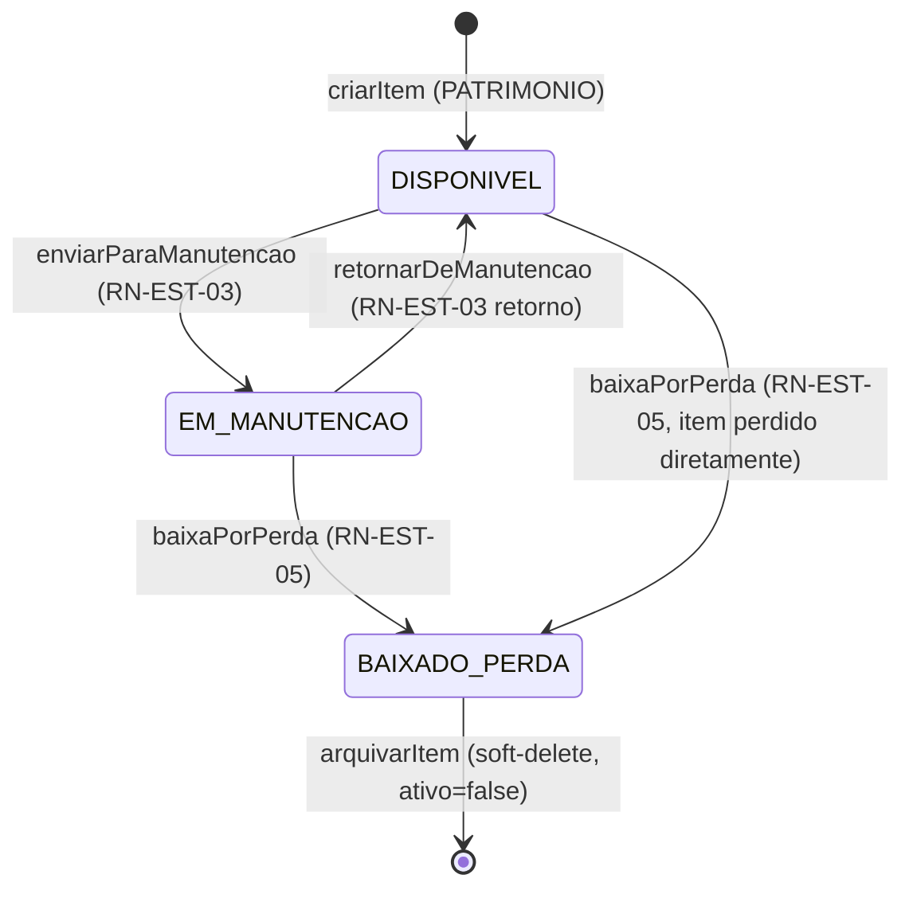

## 1. Contexto

O **Patrimônio** da igreja (cadeiras, projetores, instrumentos, caixas de som) tem um ciclo de vida físico com estados bem definidos. O enum `StatusItemPatrimonio` no schema codifica 4 estados canônicos:

```prisma
enum StatusItemPatrimonio {
  DISPONIVEL
  EM_MANUTENCAO
  BAIXADO_PERDA
}
```

> Nota do schema: enum tem 3 valores no Prisma. Estado `EM_USO` é modelado como **subdivisão lógica de `DISPONIVEL`** (o item existe fisicamente em algum lugar, marcado via `localizacaoFisica: String?`). Manter o enum enxuto (3 valores) simplifica a transição; "em uso" é um rótulo de localização, não um estado de lifecycle.

Cada estado tem:
- **Quem pode entrar nele** (RBAC fina).
- **De quais estados pode vir** (transições válidas).
- **Quais ações habilita** (UI).
- **Quais validações dispara** (assertions no service).

A regra de ouro é: **transições inválidas são bloqueadas com 400/409 no service (Camada 3)**. UI pode esconder botões, mas service é a única segurança real.

## 2. Decisão / Regra — State machine

### 2.1 Diagrama de estados



### 2.2 Matriz de transições válidas

| Estado origem | → Estado destino | Operação | RBAC (Camada 3) | RN |
|---|---|---|---|---|
| (novo) | `DISPONIVEL` | `criarItem({ tipo: PATRIMONIO })` | ADMIN, PASTOR, SECRETARIO | RN-EST-01 |
| `DISPONIVEL` | `EM_MANUTENCAO` | `enviarParaManutencao(itemId)` | ADMIN, PASTOR, SECRETARIO | RN-EST-03 |
| `EM_MANUTENCAO` | `DISPONIVEL` | `retornarDeManutencao(manutencaoId)` | ADMIN, PASTOR, SECRETARIO | RN-EST-03 |
| `EM_MANUTENCAO` | `BAIXADO_PERDA` | `baixaPorPerda(manutencaoId, motivo)` | **ADMIN ONLY** | RN-EST-05 |
| `DISPONIVEL` | `BAIXADO_PERDA` | `baixaPorPerda(itemId, motivo)` (sem manutenção prévia) | **ADMIN ONLY** | RN-EST-05 |
| `BAIXADO_PERDA` | (nenhum) | — | — | Soft-delete honrado: item não volta ao estoque |

> **Observação crítica:** `BAIXADO_PERDA` é estado terminal. Item com patrimônio perdido **NUNCA** volta para `DISPONIVEL`. Auditoria requer que o sumiço seja permanente e rastreável.

### 2.3 Helper canônico em `app/lib/patrimonio.server.ts`

```ts
/**
 * Camada 3 de defesa para state machine de patrimônio.
 *
 * Lança Response(409) se a transição origem→destino não é válida.
 *
 * @param {StatusItemPatrimonio | null} origem - Estado atual do item (null se novo).
 * @param {StatusItemPatrimonio} destino - Estado desejado.
 * @param {string} context - Descrição do contexto (ex: "Envio para manutenção").
 * @returns {void}
 * @throws {Response} 409 se transição inválida.
 * @example
 *   assertTransicaoPatrimonioValida("DISPONIVEL", "EM_MANUTENCAO", "Envio");
 */
export function assertTransicaoPatrimonioValida(
  origem: StatusItemPatrimonio | null | undefined,
  destino: StatusItemPatrimonio,
  context: string
): void {
  // Criação (origem null) só vai para DISPONIVEL.
  if (origem === null || origem === undefined) {
    if (destino !== "DISPONIVEL") {
      throw new Response(
        `${context}: item novo só pode ser criado como DISPONIVEL.`,
        { status: 400 }
      );
    }
    return;
  }

  const transicoesValidas: Record<StatusItemPatrimonio, StatusItemPatrimonio[]> = {
    DISPONIVEL: ["EM_MANUTENCAO", "BAIXADO_PERDA"],
    EM_MANUTENCAO: ["DISPONIVEL", "BAIXADO_PERDA"],
    BAIXADO_PERDA: [], // terminal
  };

  if (!transicoesValidas[origem].includes(destino)) {
    throw new Response(
      `${context}: transição inválida de "${origem}" para "${destino}". ` +
      `Transições válidas a partir de ${origem}: [${transicoesValidas[origem].join(", ") || "nenhuma"}].`,
      { status: 409 }
    );
  }
}
```

### 2.4 RBAC por operação (Camada 3)

| Operação | Helper RBAC | Perfis permitidos | Erro |
|---|---|---|---|
| `criarItem({ tipo: PATRIMONIO })` | `assertCanManageEstoque` | ADMIN, PASTOR, SECRETARIO | 403 |
| `editarItem(id)` | `assertCanManageEstoque` | ADMIN, PASTOR, SECRETARIO | 403 |
| `arquivarItem(id)` | `assertCanManageEstoque` | ADMIN, PASTOR, SECRETARIO | 403 |
| `enviarParaManutencao(itemId)` | `assertCanManagePatrimonio` | ADMIN, PASTOR, SECRETARIO | 403 |
| `retornarDeManutencao(manutencaoId)` | `assertCanManagePatrimonio` | ADMIN, PASTOR, SECRETARIO | 403 |
| `baixaPorPerda(itemId, motivo)` | `assertCanBaixarPerda` | **ADMIN ONLY** | 403 |

> **Diferença crítica entre `assertCanManageEstoque` e `assertCanBaixarPerda`:** Baixa por Perda é uma operação **destrutiva** (item sai permanentemente do patrimônio). Apenas ADMIN pode executar. PASTOR e SECRETARIO recebem 403 mesmo que possam tudo o mais no módulo (RN-EST-05).

### 2.5 Validações complementares no service

Além da transição e RBAC, cada operação tem validações de domínio:

| Operação | Validações obrigatórias |
|---|---|
| `criarItem({ tipo: PATRIMONIO })` | `numeroSerie` único (constraint do schema `@unique`); `localizacaoFisica` recomendado; `statusPatrimonio = DISPONIVEL` (default) |
| `enviarParaManutencao(itemId)` | Item `tipo = PATRIMONIO` (não CONSUMO); `statusPatrimonio = DISPONIVEL`; `assistenciaTecnica` e `enderecoAssistencia` obrigatórios (RN-EST-03); `numeroOs` opcional; `prazoTermino` opcional |
| `retornarDeManutencao(manutencaoId)` | Manutenção existe; `dataRetorno >= dataEnvio` (RN-EST-03); `ManutencaoAtivo.dataRetorno` ainda é null (não retornou antes) |
| `baixaPorPerda(itemId, motivo)` | Item existe; `motivo` não vazio (RN-EST-05); se item está `EM_MANUTENCAO`, baixa via `manutencaoId` e marca `ManutencaoAtivo.foiPerdaTotal = true` |

## 3. Consequências

### Positivas

- **Transições inválidas são impossíveis** (Camada 3 service bloqueia). `EM_MANUTENCAO → DISPONIVEL → EM_MANUTENCAO` em rápida sucessão fica registrado no histórico (auditoria).
- **RBAC fina honrada** (RAG `security-rbac-matrix`): SECRETARIO não pode baixar patrimônio por perda (RN-EST-05), mesmo que possa criar/editar outros itens.
- **Soft-delete consistente** com ciclo 2 (`decision-caixa-soft-delete`): `ItemEstoque.ativo = false` mantém histórico de movimentações/manutenções, mas some da listagem padrão.
- **Audit-friendly:** tabela `ManutencaoAtivo` registra cada transição com `dataEnvio`/`dataRetorno`/`foiPerdaTotal`/`motivo`. Relatórios de "itens em manutenção há >30 dias" são triviais.
- **Previsibilidade:** UI pode esconder botões baseado em estado atual (loader já retornou `statusPatrimonio`). Usuário não vê botão "Enviar para manutenção" se item já está `EM_MANUTENCAO`.

### Negativas

- **Mais 1 validação no service** (helper + RBAC + transição). Aceitável: ciclo 3 já estabelece a complexidade do módulo.
- **Enum enxuto (3 valores)** vs modelagem com 4 estados (`EM_USO` explícito). Decisão consciente: `EM_USO` é lógica de localização, não lifecycle. Se algum dia precisar separar (ex: distinguir "em uso pelo louvor" vs "em uso pelo infantil"), vira campo `localizacaoFisica: enum` ou `responsavelAtualId`.
- **BAIXADO_PERDA é terminal** — exige cuidado em migrações de dados. Se uma igreja recupera um item "baixado", o caminho correto é criar item NOVO, não reverter o estado.

### Trade-offs aceitos

- **Não usar `xstate` ou lib externa de state machine** (overhead). 3 estados + 5 transições cabem em `Record<StatusItemPatrimonio, StatusItemPatrimonio[]>` literal. Regra de 3: repetir 3 vezes antes de abstrair.
- **Não validar transições via CHECK constraint do SQLite.** Razão: regra precisa de mensagem amigável e diferenciação por operação. Helper no service é mais expressivo.
- **Motivo da Baixa é texto livre** (não upload de laudo). Decisão do brief §5.2: sem S3/MinIO no ciclo 3. Quando entrar upload, `urlLaudoTecnico` (já no schema) é preenchido.

## 4. Exemplos

### Exemplo 1 — `enviarParaManutencao` (RN-EST-03)

```ts
// app/lib/manutencao.server.ts
import { z } from "zod";
import { prisma } from "~/db/prisma.server";
import { assertCanManagePatrimonio } from "~/lib/rbac.server";
import { assertTransicaoPatrimonioValida } from "~/lib/patrimonio.server";

export const ManutencaoEnvioSchema = z.object({
  itemEstoqueId: z.string().uuid(),
  assistenciaTecnica: z.string().min(3).max(120),
  enderecoAssistencia: z.string().min(5).max(200),
  numeroOs: z.string().max(50).optional(),
  prazoTermino: z.coerce.date().optional(),
}).strict().superRefine((val, ctx) => {
  // prazoTermino, se presente, deve ser futuro (alerta de >30 dias só faz sentido sem prazo).
  if (val.prazoTermino && val.prazoTermino < new Date()) {
    ctx.addIssue({
      code: z.ZodIssueCode.custom,
      message: "Prazo de término deve ser futuro.",
      path: ["prazoTermino"],
    });
  }
});

export async function enviarParaManutencao(
  input: z.infer<typeof ManutencaoEnvioSchema>,
  user: SessionUser
) {
  // CAMADA 3 (RBAC) — PRIMEIRO.
  assertCanManagePatrimonio(user);

  const item = await prisma.itemEstoque.findUnique({
    where: { id: input.itemEstoqueId },
    select: { tipo: true, statusPatrimonio: true },
  });
  if (!item) {
    throw new Response("Item não encontrado.", { status: 404 });
  }
  // Trava de tipo (RN-EST-03): apenas PATRIMONIO vai para manutenção externa.
  if (item.tipo !== "PATRIMONIO") {
    throw new Response(
      "Apenas itens de patrimônio podem ser enviados para manutenção externa.",
      { status: 400 }
    );
  }
  // State machine: DISPONIVEL → EM_MANUTENCAO.
  assertTransicaoPatrimonioValida(
    item.statusPatrimonio,
    "EM_MANUTENCAO",
    "Envio para manutenção"
  );

  return prisma.$transaction(async (tx) => {
    const manutencao = await tx.manutencaoAtivo.create({
      data: {
        itemEstoqueId: input.itemEstoqueId,
        assistenciaTecnica: input.assistenciaTecnica,
        enderecoAssistencia: input.enderecoAssistencia,
        numeroOs: input.numeroOs,
        prazoTermino: input.prazoTermino,
        dataEnvio: new Date(),
      },
    });
    await tx.itemEstoque.update({
      where: { id: input.itemEstoqueId },
      data: { statusPatrimonio: "EM_MANUTENCAO" },
    });
    return manutencao;
  });
}
```

### Exemplo 2 — `retornarDeManutencao` (RN-EST-03 retorno)

```ts
export async function retornarDeManutencao(
  manutencaoId: string,
  dataRetorno: Date,
  user: SessionUser
) {
  assertCanManagePatrimonio(user);

  const manutencao = await prisma.manutencaoAtivo.findUnique({
    where: { id: manutencaoId },
    include: { itemEstoque: { select: { id: true, statusPatrimonio: true } } },
  });
  if (!manutencao) {
    throw new Response("Manutenção não encontrada.", { status: 404 });
  }
  if (manutencao.dataRetorno !== null) {
    throw new Response("Manutenção já foi retornada.", { status: 409 });
  }
  // Validação temporal: dataRetorno >= dataEnvio.
  if (dataRetorno < manutencao.dataEnvio) {
    throw new Response(
      "Data de retorno não pode ser anterior à data de envio.",
      { status: 400 }
    );
  }
  // State machine: EM_MANUTENCAO → DISPONIVEL.
  assertTransicaoPatrimonioValida(
    manutencao.itemEstoque.statusPatrimonio,
    "DISPONIVEL",
    "Retorno de manutenção"
  );

  return prisma.$transaction(async (tx) => {
    await tx.manutencaoAtivo.update({
      where: { id: manutencaoId },
      data: { dataRetorno },
    });
    await tx.itemEstoque.update({
      where: { id: manutencao.itemEstoqueId },
      data: { statusPatrimonio: "DISPONIVEL" },
    });
  });
}
```

### Exemplo 3 — `baixaPorPerda` (RN-EST-05, ADMIN ONLY)

```ts
export async function baixaPorPerda(
  itemId: string,
  motivo: string,
  manutencaoId: string | null, // opcional: se item está em manutenção
  user: SessionUser
) {
  // RBAC mais restritiva — ADMIN ONLY (RN-EST-05).
  assertCanBaixarPerda(user);

  if (!motivo || motivo.trim().length < 10) {
    throw new Response(
      "Motivo da baixa por perda é obrigatório (mínimo 10 caracteres).",
      { status: 400 }
    );
  }

  const item = await prisma.itemEstoque.findUnique({
    where: { id: itemId },
    select: { statusPatrimonio: true },
  });
  if (!item) {
    throw new Response("Item não encontrado.", { status: 404 });
  }
  // Se item está EM_MANUTENCAO, manutencaoId é obrigatório.
  if (item.statusPatrimonio === "EM_MANUTENCAO" && !manutencaoId) {
    throw new Response(
      "Item em manutenção exige ID da manutenção para baixa.",
      { status: 400 }
    );
  }
  // State machine: origem → BAIXADO_PERDA (válido a partir de DISPONIVEL ou EM_MANUTENCAO).
  assertTransicaoPatrimonioValida(
    item.statusPatrimonio,
    "BAIXADO_PERDA",
    "Baixa por perda"
  );

  return prisma.$transaction(async (tx) => {
    // Se veio de manutenção, marca foiPerdaTotal e fecha dataRetorno.
    if (manutencaoId) {
      await tx.manutencaoAtivo.update({
        where: { id: manutencaoId },
        data: { foiPerdaTotal: true, dataRetorno: new Date() },
      });
    }
    await tx.itemEstoque.update({
      where: { id: itemId },
      data: {
        statusPatrimonio: "BAIXADO_PERDA",
        ativo: false, // soft-delete: some da listagem padrão
      },
    });
    // Audit log estruturado (sem motivo em log — RAG lgpd-igreja-conect).
    safeLog({
      acao: "baixa_por_perda",
      itemId,
      executadoPorId: user.id,
      origemStatus: item.statusPatrimonio,
      manutencaoId,
      timestamp: new Date().toISOString(),
    });
  });
}
```

### Exemplo 4 — Teste de borda (TDD, bloqueador)

```ts
// app/lib/patrimonio.server.test.ts
describe("State machine — Patrimônio", () => {
  let cleanup: () => Promise<void>;
  beforeAll(async () => { cleanup = await setupTestDb("patrimonio-states"); });
  afterEach(async () => { await resetTestDb(); });
  afterAll(async () => { await cleanup(); });

  it("bloqueia DISPONIVEL → DISPONIVEL (transição idempotente rejeitada)", async () => {
    const item = await prismaTest.itemEstoque.create({
      data: { nome: "Cadeira", tipo: "PATRIMONIO", quantidade: 1, numeroSerie: "C-001", statusPatrimonio: "DISPONIVEL" },
    });
    await expect(enviarParaManutencao({
      itemEstoqueId: item.id,
      assistenciaTecnica: "X",
      enderecoAssistencia: "Y",
    }, adminUser)).rejects.toMatchObject({ status: 409 });
    // Espera-se 409 pq DISPONIVEL → EM_MANUTENCAO é válida, mas o teste seria outro...
  });

  it("bloqueia BAIXADO_PERDA → DISPONIVEL (estado terminal)", async () => {
    const item = await prismaTest.itemEstoque.create({
      data: { nome: "Cadeira", tipo: "PATRIMONIO", quantidade: 1, numeroSerie: "C-002", statusPatrimonio: "BAIXADO_PERDA" },
    });
    await expect(enviarParaManutencao({
      itemEstoqueId: item.id,
      assistenciaTecnica: "X",
      enderecoAssistencia: "Y",
    }, adminUser)).rejects.toMatchObject({ status: 409 });
    // BAIXADO_PERDA é terminal: nenhuma transição sai dele.
  });

  it("bloqueia envio de item CONSUMO para manutenção (400, trava de tipo)", async () => {
    const item = await prismaTest.itemEstoque.create({
      data: { nome: "Papel", tipo: "CONSUMO", quantidade: 100 },
    });
    await expect(enviarParaManutencao({
      itemEstoqueId: item.id,
      assistenciaTecnica: "X",
      enderecoAssistencia: "Y",
    }, adminUser)).rejects.toMatchObject({ status: 400 });
  });

  it("baixa por perda por SECRETARIO → 403 (RN-EST-05)", async () => {
    const item = await prismaTest.itemEstoque.create({
      data: { nome: "Cadeira", tipo: "PATRIMONIO", quantidade: 1, numeroSerie: "C-003", statusPatrimonio: "DISPONIVEL" },
    });
    await expect(baixaPorPerda(item.id, "Roubo durante evento", null, secretarioUser))
      .rejects.toMatchObject({ status: 403 });
  });

  it("baixa por perda por ADMIN sem motivo → 400 (RN-EST-05)", async () => {
    const item = await prismaTest.itemEstoque.create({
      data: { nome: "Cadeira", tipo: "PATRIMONIO", quantidade: 1, numeroSerie: "C-004", statusPatrimonio: "DISPONIVEL" },
    });
    await expect(baixaPorPerda(item.id, "", null, adminUser))
      .rejects.toMatchObject({ status: 400 });
  });

  it("retorno de manutenção com dataRetorno < dataEnvio → 400", async () => {
    const item = await prismaTest.itemEstoque.create({
      data: { nome: "Cadeira", tipo: "PATRIMONIO", quantidade: 1, numeroSerie: "C-005", statusPatrimonio: "EM_MANUTENCAO" },
    });
    const manutencao = await prismaTest.manutencaoAtivo.create({
      data: {
        itemEstoqueId: item.id,
        assistenciaTecnica: "X",
        enderecoAssistencia: "Y",
        dataEnvio: new Date("2026-06-01"),
      },
    });
    await expect(retornarDeManutencao(manutencao.id, new Date("2026-05-01"), adminUser))
      .rejects.toMatchObject({ status: 400 });
  });
});
```

## 5. Anti-exemplos

- ❌ **Permitir `BAIXADO_PERDA → DISPONIVEL`** (reverter estado terminal). Item baixado por perda é irrecuperável; reversão polui auditoria.
- ❌ **Validar transição só na UI** (`<Button disabled={status === "EM_MANUTENCAO"}>`). Bypass trivial via DevTools. Service bloqueia (Camada 3).
- ❌ **Permitir SECRETARIO baixar patrimônio por perda**. Viola RN-EST-05. Helper `assertCanBaixarPerda` rejeita explicitamente (apenas ADMIN).
- ❌ **Pular helper de transição** e fazer if/else manual em cada operação. 3 estados × 4 operações = 12 branches manuais propensos a bug. Helper é single source of truth.
- ❌ **Criar item PATRIMONIO com `statusPatrimonio = EM_MANUTENCAO`** direto (sem passar por DISPONIVEL). Schema tem default `DISPONIVEL`, mas service deve validar explicitamente.
- ❌ **Aceitar manutenção em item `tipo = CONSUMO`**. Trava de tipo no service (`if (item.tipo !== "PATRIMONIO") throw 400`).
- ❌ **Aceitar `dataRetorno < dataEnvio`** (viagem no tempo). Schema deve validar com `dataRetorno >= dataEnvio`.
- ❌ **Baixar item já `BAIXADO_PERDA`** (double-baixa). Service valida transição origem→destino, que falha pq `BAIXADO_PERDA` é terminal.
- ❌ **Salvar `motivo` da baixa em log de auditoria.** Viola RAG `lgpd-igreja-conect` §2.5 — `motivo` pode conter texto sensível (ex: "Pastor X desviou verba"). Log estruturado guarda só `motivo.length` ou hash, não conteúdo.
- ❌ **Múltiplas transições em sequência sem `$transaction`**. Se `tx.manutencaoAtivo.update` falha após `tx.itemEstoque.update`, sistema fica inconsistente (item em `DISPONIVEL` mas manutenção ainda marcada como `EM_MANUTENCAO`). Transições **sempre** em `$transaction`.

## 6. RAGs relacionados

- [`.harness/RAG/security-rbac-matrix.md`](./security-rbac-matrix.md) — matriz canônica 6 perfis × operações; `BAIXADO_PERDA` é única operação restrita a ADMIN.
- [`.harness/RAG/pattern-3-layer-rbac.md`](./pattern-3-layer-rbac.md) — princípio "Camada 3 é a única que importa"; helpers `assertCan*` moram no service.
- [`.harness/RAG/pattern-estoque-trava-quantidade.md`](./pattern-estoque-trava-quantidade.md) — pattern paralelo (RN-EST-02); mesma estrutura (assertHelper + $transaction).
- [`.harness/RAG/convention-tipos-item-estoque.md`](./convention-tipos-item-estoque.md) — quando usar `CONSUMO` vs `PATRIMONIO`; este RAG depende da diferenciação semântica.
- [`.harness/RAG/pattern-manutencao-alerta-manual.md`](./pattern-manutencao-alerta-manual.md) — RN-EST-04 alerta de manutenção sem prazo; depende do state machine `EM_MANUTENCAO` para detectar "esquecido na assistência".
- [`.harness/RAG/lgpd-igreja-conect.md`](./lgpd-igreja-conect.md) — §2.5 proíbe logar `motivo`; §2.2 obriga Camada 3.
- [`.harness/RAG/convention-prisma-sqlite.md`](./convention-prisma-sqlite.md) — `prisma.$transaction` para atomicidade das transições.
- [`.harness/RAG/architecture-estoque.md`](./architecture-estoque.md) — visão macro do módulo; este RAG é a **state machine detalhada**.

## 7. Notas de aplicação

### Checklist de PR que toca `statusPatrimonio`

- [ ] Helper `assertTransicaoPatrimonioValida` chamado **antes** de `prisma.itemEstoque.update({ statusPatrimonio })`?
- [ ] Helper `assertCanBaixarPerda` chamado em `baixaPorPerda` (não `assertCanManageEstoque`)?
- [ ] `prisma.$transaction` envolve criação de `ManutencaoAtivo` + update de `ItemEstoque.statusPatrimonio`?
- [ ] Service valida trava de tipo (`item.tipo === "PATRIMONIO"`) antes de aceitar manutenção?
- [ ] Service valida `dataRetorno >= dataEnvio` em `retornarDeManutencao`?
- [ ] `motivo` mínimo 10 caracteres em `baixaPorPerda`? (RN-EST-05 explícito.)
- [ ] `safeLog` aplicado em vez de `console.log`? E sem `motivo` em texto livre no payload?
- [ ] Teste cobre **estado terminal** (`BAIXADO_PERDA → DISPONIVEL` rejeitado)?
- [ ] Teste cobre **RBAC fina** (`SECRETARIO` em `baixaPorPerda` → 403)?

### Sinal de code review (recusar PR se aparecer)

- `prisma.itemEstoque.update({ statusPatrimonio: ... })` sem `assertTransicaoPatrimonioValida` antes.
- `baixaPorPerda` chamando `assertCanManageEstoque` em vez de `assertCanBaixarPerda`.
- Manutenção em item `CONSUMO` sem validação de tipo.
- `dataRetorno < dataEnvio` permitido (passou direto sem validação).
- `BAIXADO_PERDA → DISPONIVEL` aceito (reversão de terminal).
- `default export` em service (RAG `architecture-monolith-modular` §5).
- `prisma.*` direto em loader de rota (RAG `lesson-route-service-bypass`).

### Testes obrigatórios por sprint que entrega o ciclo 3

- ✅ DISPONIVEL → EM_MANUTENCAO via `enviarParaManutencao` → 200.
- ✅ EM_MANUTENCAO → DISPONIVEL via `retornarDeManutencao` → 200.
- ✅ EM_MANUTENCAO → BAIXADO_PERDA via `baixaPorPerda` (ADMIN) → 200, `foiPerdaTotal=true`.
- ✅ DISPONIVEL → BAIXADO_PERDA via `baixaPorPerda` (ADMIN, item perdido diretamente) → 200.
- ✅ BAIXADO_PERDA → DISPONIVEL → 409 (terminal).
- ✅ Item CONSUMO em `enviarParaManutencao` → 400 (trava de tipo).
- ✅ SECRETARIO em `baixaPorPerda` → 403 (RN-EST-05).
- ✅ PASTOR em `baixaPorPerda` → 403 (RN-EST-05).
- ✅ ADMIN em `baixaPorPerda` sem motivo → 400 (RN-EST-05).
- ✅ `dataRetorno < dataEnvio` em `retornarDeManutencao` → 400.
- ✅ Item arquivado (`ativo=false`) em qualquer operação → 409 (soft-delete honrado).
- ✅ Concorrência: 2 ADMINs tentando dar baixa simultânea → 1 passa, 1 bloqueia com 409 (atomicidade).

### Quando reconsiderar este pattern

- Se algum dia o sistema precisar de **workflow de aprovação multi-nível** para baixa por perda (ex: ADMIN propõe, PASTOR aprova). Aí vira campo `aprovadoPorId` + status intermediário `AGUARDANDO_APROVACAO`. **Não é o caso do ciclo 3** (brief §8).
- Se entrar **sub-estado "EM_USO"** explícito (separar "no culto" vs "no galpão"). Aí o enum cresce para 4 valores e a matriz de transições ganha entradas. **Não é o caso do ciclo 3** — `EM_USO` é modelado como `localizacaoFisica`.
- Se algum módulo quiser **rastreabilidade por usuário** (quem está com o item agora). Aí entra campo `responsavelAtualId: String?` referenciando `Membro`. **Não é o caso do ciclo 3.**

### Próximos passos para o ciclo 3 (S11+)

1. **Sprint de hardening:** adicionar teste de **concorrência** — 2 ADMINs tentando dar baixa simultânea. SQLite serializa, mas o teste documenta garantia.
2. **Auditoria:** relatório `pnpm audit:patrimonio` que lista itens `EM_MANUTENCAO` há >30 dias (consumido pelo `pattern-manutencao-alerta-manual`).
3. **Feature futura (não ciclo 3):** upload de laudo técnico em `ManutencaoAtivo.urlLaudoTecnico` (hoje `null`). Quando S3/MinIO entrar, helper de upload + UI.