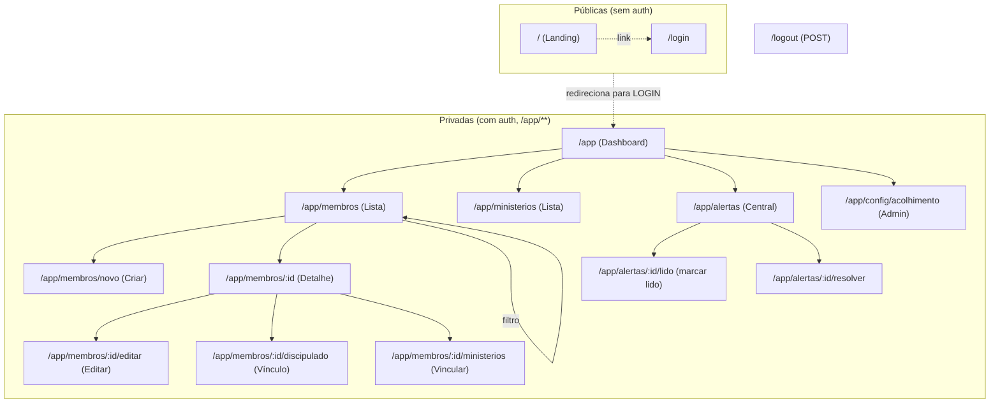

# Igreja Conect — PRODUCT.md

> **Documento macro de produto (design).** Visão geral do que o sistema é, como se navega, como o RBAC aparece na UI, quais padrões de formulário/listagem/feedback usamos, e quais decisões de design estão consolidadas.
>
> **Público-alvo:** devs frontend, designers de produto, novos agentes do Harness, e Product Managers da igreja.
>
> **Data:** 2026-06-12 • **Versão:** 0.1 (MVP) • **Mantido por:** `designer` agent (Fase 3 do Harness v6).
>
> **Fontes:** [`PRD.html`](../../PRD.html) (requisitos), [`SPEC.html`](../../SPEC.html) (contratos), [`agents/AGENTS.md`](../../agents/AGENTS.md) (stack/convenções), [`docs/architecture/ARCH.md`](../../docs/architecture/ARCH.md) (arquitetura), e os 5 RAGs em `.harness/RAG/`.

---

## 1. Princípios de UX/UI

### 1.1 Linguagem visual

- **Clean, sem ruído, foco em legibilidade.** A igreja é um espaço sóbrio — o sistema também precisa ser. Nada de gradientes chamativos, sombras pesadas, animações decorativas.
- **Inspiração de produto:** ferramentas administrativas internas (Linear, Notion, ERPs médicos). Densidade de informação média-alta, mas com respiro.
- **Tom da copy:** PT-BR, segunda pessoa do singular ou tratamento respeitoso (Senhor/Senhora Pastor(a)). Nunca gíria, nunca emoji em mensagens formais. Emoji só em empty states amigáveis (ex: "Nenhum membro por aqui ainda 🎈" — *opcional*).
- **Fé sem proselitismo técnico:** o sistema serve a operação, não faz marketing da igreja. Sem versículos na UI, sem "Deus abençoe este deploy".

### 1.2 Sistema de design

- **Tailwind 4 utility-first.** Sem `@apply` em CSS novo. Tokens via `@theme`.
- **Paleta** (consolidada — ver também `arch/architecture/ARCH.md §3` e PRD §1):
  - **Primária:** `cyan-700` (`#0e7490`) — sóbria, sem o clichê "azul eclesiástico". Usada em botões primários, links, ícones de status.
  - **Neutros:** `slate-50` a `slate-900` (background, texto, bordas).
  - **Semântica:**
    - `green-700` (`#047857`) — sucesso, validado.
    - `amber-700` (`#b45309`) — atenção, regra de negócio próxima do limite.
    - `red-700` (`#b91c1c`) — erro, bloqueio.
  - **Modo escuro:** fora do MVP (registrar como item de roadmap).
- **Tipografia:** stack do sistema (`-apple-system, BlinkMacSystemFont, "Segoe UI", Roboto, "Helvetica Neue", Arial`). Sem Google Fonts (sem privacidade de terceiros — LGPD). Tamanhos: `text-sm` (formulários), `text-base` (corpo), `text-lg` (subtítulos), `text-xl` (títulos de seção), `text-2xl` (h1).
- **Espaçamento:** grid de 4px. Escala: `0.5, 1, 1.5, 2, 3, 4, 6, 8, 12, 16` (rem). Containers principais com `max-w-6xl` e `px-4 sm:px-6`.
- **Componentes base (reutilizáveis, sem dependência externa de lib):**
  - `<Button variant="primary|secondary|ghost|danger" size="sm|md" />`
  - `<Input label="" hint="" error="" leadingIcon="" />` (form fields com label, hint, erro, ARIA)
  - `<Select options={[]} />`
  - `<Card />` (container neutro com `border` + `rounded-lg` + `p-4`)
  - `<Badge tone="neutral|success|warning|danger" />`
  - `<EmptyState title="" description="" action={} />`
  - `<Spinner />`, `<Skeleton rows={3} />`
  - `<Toast />` (sistema interno; ver §6)
  - **Justificativa do "sem lib de UI" (shadcn, Radix etc.):** evita dependency drift, mantém o bundle pequeno, força clareza. Quando a 3ª tela precisar de `<Dialog>` (excluir membro com confirmação), aí sim avaliar uma lib focada (ex: `@radix-ui/react-dialog` 1 dep) — não antes.

### 1.3 Acessibilidade (LGPD art. 6° + WCAG 2.1 AA)

- **Contraste mínimo AA** (4.5:1 texto normal, 3:1 texto grande). Auditar com Lighthouse no PR.
- **Foco visível** em todo elemento interativo (`focus-visible:ring-2 ring-cyan-700 ring-offset-2`).
- **Navegação por teclado completa** (Tab/Shift+Tab/Enter/Esc). Ordem de foco segue ordem visual.
- **Labels associados** via `<label htmlFor>` em todo input. `aria-describedby` para hint e erro.
- **`aria-invalid`** em campos com erro de validação. **`aria-live="polite"`** em toasts e mensagens de feedback.
- **Ícones decorativos** com `aria-hidden="true"`. Ícones com significado precisam de `aria-label` no botão.
- **Hierarquia de headings** correta (`h1` por página, `h2` por seção, sem pular níveis).
- **Tabelas** com `<caption>` (pode ser `sr-only`), `<th scope="col">`, e cabeçalhos de linha quando apropriado.
- **Sem dependência de cor apenas** para feedback (erro = ícone + texto + cor, não só cor).

### 1.4 Responsividade (mobile-first)

- **Breakpoints** (Tailwind padrão): `sm` (640px), `md` (768px), `lg` (1024px), `xl` (1280px).
- **Abordagem:** mobile-first. Estilos base para ≤ 640px; amplia em `md:` e `lg:`.
- **Layout principal autenticado:** sidebar em `lg+`, topbar com hamburger em `sm/md`.
- **Tabelas:** em mobile (`<md`), viram **cards** com mesma informação (não scroll horizontal — *mobile é uso real, não preview*).
- **Formulários:** full-width em mobile, `max-w-md mx-auto` em tablet+, `max-w-2xl` em desktop (formulários de membros, que são densos).
- **Targets de toque:** mínimo 44×44px (Apple HIG). Botões pequenos em desktop são permitidos, mas em mobile ganham `min-h-[44px]`.

### 1.5 Internacionalização

- **PT-BR único no MVP.** Sem `i18n`, sem `react-intl`. Toda copy hardcoded em português.
- **Datas e números** com `Intl.DateTimeFormat("pt-BR")` e `Intl.NumberFormat("pt-BR", { style: "currency", currency: "BRL" })`.
- **URLs em PT-BR sem acentos:** `/app/membros`, `/app/membros/novo`, `/app/alertas`, `/app/config/acolhimento`. *Nunca* `/app/financeiro` é mock, e *nunca* `/app/members` (inglês na rota, confusão cognitiva).
- **Se i18n entrar em sprint futura:** avaliar `i18next` (padrão de mercado). **Não criar abstração agora** (YAGNI).

---

## 2. Estrutura de navegação global

### 2.1 Diagrama de rotas (públicas × privadas)



**Convenção:** rotas privadas em `app/routes/private/**`, públicas em `app/routes/public/**`. Endpoint de logout em `app/api/auth/logout.ts` (POST).

### 2.2 Layout do shell autenticado

```
┌──────────────────────────────────────────────────────────────┐
│ Topbar: [Logo] [Busca global]      [Alertas 🔔] [Avatar ▼]  │ ← h-14, border-b
├────────────┬─────────────────────────────────────────────────┤
│            │                                                 │
│ Sidebar    │  Conteúdo da rota                               │
│            │                                                 │
│ • Dashboard│  ┌──────────────────────────────────────────┐  │
│ • Membros  │  │ Breadcrumb > Membros > João da Silva     │  │
│ • Ministé- │  ├──────────────────────────────────────────┤  │
│   rios     │  │                                          │  │
│ • Alertas  │  │  Página específica                      │  │
│ • Config   │  │                                          │  │
│   (Admin)  │  │                                          │  │
│            │  │                                          │  │
│ ─────      │  │                                          │
│ Sair       │  │                                          │
│            │  └──────────────────────────────────────────┘  │
│            │                                                 │
└────────────┴─────────────────────────────────────────────────┘
```

**Comportamento:**
- **lg+ (≥1024px):** sidebar fixa 240px. Topbar 100% width.
- **md (768-1023):** sidebar colapsada (só ícones), expande em hover.
- **sm (<768):** sidebar escondida. Hamburger na topbar abre drawer lateral (overlay).
- **Avatar dropdown:** `Meu perfil` (futuro, fora do MVP), `Sair`.
- **Contador de alertas não lidos** no ícone da topbar (badge `bg-amber-600` com número).

### 2.3 Padrão de breadcrumb

Formato: `Pai > Atual` (sem link no item atual, com link nos ancestrais).

- `Membros > João da Silva` (lista é pai do detalhe)
- `Membros > João da Silva > Editar`
- `Configurações > Acolhimento de visitantes`
- `Alertas > "Novo visitante cadastrado" > Marcar como resolvido` (raro — só em detalhe de alerta, se entrar em sprint futura)

Componente: `<Breadcrumb items={[{label, href?}]} />`. Separador `>` em `text-slate-400`. Item atual em `font-medium text-slate-900`. Ancestrais com `<Link to>` em `text-cyan-700 hover:underline`.

---

## 3. RBAC e visibilidade na UI

### 3.1 Matriz perfil × visibilidade de UI

Fonte: RAG `.harness/RAG/security-rbac-matrix.md §2` e PRD §2.

| Tela / Componente | ADMIN | PASTOR | SECRETARIO | DISCIPULADOR | LIDER_MIN. | FINANCEIRO |
|---|:-:|:-:|:-:|:-:|:-:|:-:|
| **Sidebar — Dashboard** | 👁 | 👁 | 👁 | 👁 | 👁 | 👁 |
| **Sidebar — Membros** | 👁 | 👁 | 👁 | 👁 | 👁 | 👁 |
| **Sidebar — Ministérios** | 👁 | 👁 | 👁 | 👁 | 👁 | 👁 |
| **Sidebar — Alertas** | 👁 | 👁 | 👁 | 👁 | 👁 | 👁 |
| **Sidebar — Configurações** | 👁 | 👁 | 👁 | 👁 | 👁 | 👁 |
| **Membros — ações de escrita** (criar/editar/excluir) | ✅ | ✅ | ✅ | ✅ (escopo) | ✅ (escopo) | ✅ |
| **Membros — Vincular discípulo** | ✅ | ✅ | ✅ | ✅ | ✅ | ✅ |
| **Membros — Vincular a ministério** | ✅ | ✅ | ✅ | ✅ | ✅ | ✅ |
| **Membros — Aba Fidelidade Financeira** | 👁 | 👁 | 🚫 | 🚫 | 🚫 | 👁 |
| **Configurações — Acolhimento (Admin only)** | ✅ escrever | 👁 ler | 👁 ler | 👁 ler | 👁 ler | 👁 ler |
| **Botão Sair** | ✅ | ✅ | ✅ | ✅ | ✅ | ✅ |

> 👁 = visível (read-only) • ✅ = ação permitida • 🚫 = oculta completamente (defesa em profundidade — ver §3.3).

### 3.2 Componentes condicionais (camada 1)

Padrão React de renderização condicional por perfil. **Não é segurança — é UX** (camada 1 de 3, ver RAG).

```tsx
// app/components/Can.tsx (helper client-side, recebe user como prop)
type Cargo = "ADMIN" | "PASTOR" | "SECRETARIO" | "DISCIPULADOR" | "FINANCEIRO" | "LIDER_MINISTERIO";

interface CanProps {
  user: { cargo: Cargo | null };
  allow: Cargo[];
  children: ReactNode;
  fallback?: ReactNode;
}

export function Can({ user, allow, children, fallback = null }: CanProps) {
  if (!user.cargo || !allow.includes(user.cargo)) return <>{fallback}</>;
  return <>{children}</>;
}
```

**Uso em JSX:**

```tsx
// app/components/MembroFicha.tsx
import { Can } from "~/components/Can";

export function MembroFicha({ membro, user }) {
  return (
    <div>
      <DadosPessoais membro={membro} />
      <Can user={user} allow={["ADMIN", "PASTOR", "FINANCEIRO"]}>
        <AbaFidelidadeFinanceira membroId={membro.id} />
      </Can>
    </div>
  );
}
```

### 3.3 Componentes por área de tela

| Componente | Quem vê | Como decide |
|---|---|---|
| `<AbaFidelidadeFinanceira>` | ADMIN, PASTOR, FINANCEIRO | `<Can allow={["ADMIN","PASTOR","FINANCEIRO"]}>` na UI + `assertCanSeeFinancials` no loader (camada 2) + service (camada 3) |
| `<BtnExcluirMembro>` | ADMIN, PASTOR (integridade RN-MEM-04) | `<Can allow={["ADMIN","PASTOR"]}>` na UI + assert no action |
| `<BtnEditarConfigAcolhimento>` | ADMIN | `<Can allow={["ADMIN"]}>` na UI + `assertIsAdmin` no action |
| `<BtnVincularDiscipulo>` | Qualquer (RN-MEM-01) | Sempre visível; trava de 12 implementada no service |

> **Princípio:** a UI **esconde** controles para evitar confusão (UX), mas o **bloqueio real** está no loader/action/service. Se a UI for burlada (DevTools), o backend ainda barra.

---

## 4. Padrões de formulário

### 4.1 Stack de validação: **Zod + react-hook-form**

**Decisão (resolve pendência #1 do brief):**

| Lib | Bundle | API | TS inference | i18n msgs | Decisão |
|---|---|---|---|---|---|
| **Zod** | ~12kb gz | `z.object({...})` | `z.infer<>` 1ª classe | Mensagens custom | ✅ **escolhido** |
| Valibot | ~5kb gz | `v.object({...})` | `InferOutput<>` | Mensagens custom | ❌ Ecossistema menor |
| TypeBox | ~12kb gz | `Type.Object({...})` | `Static<>` (TS) | Limitado | ❌ API verbosa |

**Justificativa:** Zod é o padrão de fato em React/RR7 em 2026. `z.infer<>` casa com o strict TS do projeto. `safeParse()` + `flatten().fieldErrors` retorna estrutura que a UI consome direto. Documentação em PT-BR abundante.

**Onde usar:**
- **Schemas em `app/lib/schemas/<domínio>.ts`** (um arquivo por domínio). Exporta `Schema` (Zod) + `Input` (tipo inferido).
- **Forms** com `react-hook-form` (12kb) + `zodResolver` (`@hookform/resolvers/zod` 1kb).
- **Não usar `useFetcher().submit` raw** sem validação prévia no client — o action revalida no server, mas feedback imediato é melhor UX.

### 4.2 Mensagens de erro (PT-BR, claras)

Padrão: **frase simples, sem jargão técnico, indica o que fazer.**

| Validação | Mensagem |
|---|---|
| Nome curto | "Nome deve ter ao menos 2 caracteres." |
| Email inválido | "E-mail inválido. Verifique o formato." |
| Email duplicado | "Este e-mail já está cadastrado." |
| CEP inválido | "CEP inválido. Use o formato 00000-000." |
| Estado sigla | "Use a sigla do estado com 2 letras (ex: SP)." |
| Auto-vínculo | "Você não pode ser seu próprio discipulador." |
| Trava 12 discípulos | "Este discipulador já possui 12 discípulos ativos. Reatribua antes de vincular mais." |
| Loop discipulado | "Este vínculo criaria um ciclo na árvore de discipulado." |
| Sem permissão | "Você não tem permissão para esta operação." |
| Sessão expirada | "Sua sessão expirou. Faça login novamente." |

### 4.3 Confirmação de ações destrutivas

**Padrão:** modal inline (não `window.confirm()` nativo — feio e inconsistente).

Ações que pedem confirmação:
- Excluir membro (se permitido)
- Desvincular discípulo
- Desvincular de ministério
- Alterar responsável pelo acolhimento (Admin)
- Marcar alerta como resolvido (irreversível? Não, mas confirmação evita clique acidental)

Componente (a ser criado quando 3ª tela precisar — YAGNI):
```tsx
<Dialog open={open} onClose={onClose} title="Excluir membro">
  <p>Tem certeza que deseja excluir <strong>{membro.nome}</strong>? Esta ação não pode ser desfeita.</p>
  <div className="flex gap-2 justify-end">
    <Button variant="ghost" onClick={onClose}>Cancelar</Button>
    <Button variant="danger" onClick={onConfirm}>Excluir</Button>
  </div>
</Dialog>
```

### 4.4 Loading states

- **Submit de form:** botão vira `<Spinner />` + texto "Salvando..." (substitui label). Desabilita para evitar double-submit.
- **Navegação SPA:** topbar mostra barra fina de progresso (1px, `bg-cyan-700`, animada) — implementado via `useNavigation()` global pending state.
- **Listagens (loader):** `<Skeleton rows={10} />` enquanto loader do RR7 não retornou.
- **Optimistic UI:** apenas onde o ganho é claro (ex: marcar alerta como lido). Em CRUD de membros, **NÃO** usar optimistic (rollback é pior que esperar).

---

## 5. Padrões de listagem

### 5.1 Filtros (URL state)

**Decisão:** filtros em **URL state** (search params), não em estado React.

Razão: compartilhável, refresh-safe, navegação back/forward funciona, linkável em mensagens ("olha essa busca: /app/membros?tipo=VISITANTE&q=maria").

**Padrão:**

```tsx
// app/components/MembrosFilters.tsx
import { Form, useSearchParams } from "react-router";

export function MembrosFilters() {
  const [params] = useSearchParams();
  return (
    <Form method="get" className="flex gap-2 flex-wrap">
      <Select name="tipo" defaultValue={params.get("tipo") ?? ""} options={[
        { value: "", label: "Todos os tipos" },
        { value: "VISITANTE", label: "Visitantes" },
        { value: "CONGREGADO", label: "Congregados" },
        { value: "MEMBRO_ATIVO", label: "Membros ativos" },
      ]} />
      <Input name="q" placeholder="Buscar por nome..." defaultValue={params.get("q") ?? ""} />
      <Button type="submit">Filtrar</Button>
    </Form>
  );
}
```

**Debounce na busca textual:** input com `onChange` que atualiza URL após 300ms de inatividade (use `useDebouncedCallback` ou um hook próprio de 5 linhas — YAGNI não justifica lib).

### 5.2 Paginação

- **Padrão:** 25 itens por página (configurável via `?pageSize=`, mas UI oferece só "25" no MVP).
- **URL:** `?page=2`.
- **UI:** `<Pagination current={page} total={Math.ceil(total / pageSize)} />` no rodapé da lista.
- **Scroll preservation:** ao paginar, mantém posição do usuário na nova página.
- **Página 1** quando filtro muda (reset implícito).

### 5.3 Empty state / loading / error

**Padrão consistente** em todas as listagens:

```tsx
// Estado loading
{items.length === 0 && loading && <Skeleton rows={5} />}

// Estado empty
{items.length === 0 && !loading && (
  <EmptyState
    title="Nenhum membro por aqui ainda"
    description="Cadastre o primeiro membro para começar."
    action={canCreate && (
      <Button as={Link} to="/app/membros/novo">+ Cadastrar membro</Button>
    )}
  />
)}

// Estado error
{error && (
  <ErrorState
    title="Não foi possível carregar os membros"
    description={error.message}
    action={<Button onClick={retry}>Tentar novamente</Button>}
  />
)}

// Estado success
{items.length > 0 && <TabelaMembros items={items} />}
```

**Empty states amigáveis** com ícone + título + descrição + (opcional) CTA. Texto em PT-BR, tom respeitoso.

---

## 6. Padrões de feedback

### 6.1 Toasts / alerts

**Stack:** sistema próprio (sem lib externa — toast são 50 linhas de código). Provider no `root.tsx`.

**API:**

```tsx
const { toast } = useToast();

toast({ tone: "success", title: "Membro cadastrado", description: `${nome} foi adicionado.` });
toast({ tone: "error", title: "Erro ao salvar", description: errorMessage });
toast({ tone: "warning", title: "Atenção", description: "..." });
toast({ tone: "info", title: "...", description: "..." });
```

**Posição:** canto inferior direito. `aria-live="polite"`. Auto-dismiss em 5s (exceto `error`, que persiste até fechar).

**Comportamento:**
- 1 toast por vez (fila simples).
- `Esc` fecha.
- Click no body da página também fecha.

### 6.2 Central de Alertas (UI)

**Tela `/app/alertas`** (ver `design/private-alertas.DESIGN.md` para detalhes).

**Card de alerta:**
- Título (`font-medium`)
- Mensagem (3 linhas, ellipsis se mais)
- Timestamp relativo ("há 5 minutos", "ontem", "12/06/2026")
- Estado: badge `lido` (verde) ou `não lido` (azul)
- Ações: "Marcar como lido" / "Marcar como resolvido" (botão secundário inline)

**Lista de alertas:**
- Mais recente primeiro.
- Sem filtros no MVP (manter escopo enxuto, PRD §3.3).
- Sem priorização (todos têm mesma urgência no MVP).

### 6.3 Confirmação visual de ações

- **Submit bem-sucedido** → toast de sucesso + redirect para a página de destino (ex: criar membro → `/app/membros/:id`).
- **Submit com erro de validação** → form mantém estado, campos com erro destacados com borda vermelha + mensagem inline abaixo do campo. Sem toast (a mensagem inline é mais perto do erro).
- **Submit com erro de regra de negócio** (ex: trava 12) → toast de erro + mantém na página.
- **Erro de rede** (500) → toast de erro genérico + opção de "Tentar novamente" inline no form.

---

## 7. Decisões de design (resolvidas nesta fase)

> Estas decisões estavam pendentes no PRD/SPEC/AGENTS. **Todas resolvidas aqui pelo `designer` agent.** O backend agent da Fase 5 deve implementar exatamente isso.

### 7.1 Biblioteca de validação: **Zod**

- **Decisão:** Zod 3.x (latest estável).
- **Justificativa:** ecossistema maduro, `z.infer<>` casa com TS strict, mensagens de erro localizáveis, padrão de fato no mercado React 2026. Valibot e TypeBox são alternativas viáveis mas sem ganho claro no MVP.
- **Implementação:** `app/lib/schemas/*.ts` (um arquivo por domínio). Exporta `Schema` + `Input` (tipo).
- **Migração futura:** se bundle size virar problema (não esperado), avaliar Valibot (5kb gz). Zod 4 também é uma alternativa.

### 7.2 TTL de sessão: **7 dias sliding, teto 30 dias absolutos**

- **Decisão:** cookie expira após **7 dias de inatividade** (sliding). Limite absoluto de **30 dias** desde a criação. Logout invalida no servidor (deleta registro `Session`).
- **Justificativa:** equilíbrio entre UX (não deslogar usuário ativo) e segurança (limite absoluto impede sessão eterna). Login é interno, mas ainda assim valor padrão razoável para 2026.
- **Implementação:** `app/lib/session.server.ts`:
  ```ts
  const SLIDING_TTL_MS = 7 * 24 * 60 * 60 * 1000; // 7 dias
  const ABSOLUTE_TTL_MS = 30 * 24 * 60 * 60 * 1000; // 30 dias
  // Em cada request autenticado:
  // session.expiresAt = min(now + 7d, session.absoluteExpiresAt)
  ```

### 7.3 Política de senha: **≥ 8 chars, sem forçar complexidade**

- **Decisão:** comprimento mínimo **8 caracteres**. Sem exigência de maiúscula/minúscula/número/símbolo. Sem expiração periódica forçada.
- **Justificativa:** NIST SP 800-63B (2020) recomenda comprimento sobre complexidade. Login é interno (não público), e complexidade forçada leva a senhas previsíveis ("Senha@2024!"). Comprimento + hash bcrypt cost 10 é suficiente para 1 igreja.
- **Implementação (Zod):**
  ```ts
  senha: z.string().min(8, "Senha deve ter ao menos 8 caracteres.").max(200)
  ```
- **Mensagem de UX:** "Use ao menos 8 caracteres. Misture letras, números e símbolos se quiser — não exigimos."

### 7.4 Aba "Fidelidade Financeira" para perfis bloqueados: **NÃO renderizar**

- **Decisão:** o componente `<AbaFidelidadeFinanceira>` **não é renderizado** para perfis `SECRETARIO`, `DISCIPULADOR`, `LIDER_MINISTERIO`. Defesa em 3 camadas (UI esconde, loader barra 403, service lança `ForbiddenError`).
- **Justificativa:** dado sensível (LGPD art. 5°, II — convicção religiosa + capacidade financeira). UX não pode nem sugerir a existência para quem não deve saber. É mais limpo que mostrar um placeholder "você não tem acesso" (vaza informação por inferência).
- **Trade-off aceito:** ADMIN/PASTOR/FINANCEIRO veem aba; para os demais, **a aba não existe na navegação** nem como link quebrado. Eles literalmente não sabem que existe.

### 7.5 Rate limit no `/login`: **5 tentativas / 15min / IP, in-memory**

- **Decisão:** `Map<ip, { count, firstAt }>` em memória. Após 5 falhas em 15min, retorna 429 com mensagem clara. Reset ao acertar.
- **Justificativa:** MVP sem Redis, sem dependência externa. In-memory é suficiente (1 processo Node, sem multi-instance). Não persiste após restart — aceitável (e até desejável: reset protege usuários).
- **Limitação conhecida:** em deployment multi-instance, cada instância tem seu próprio contador. Aceitável para 1 igreja.
- **Implementação:** `app/lib/rate-limit.server.ts` (helper puro), usado em `app/api/auth/login.ts` (action do login).

### 7.6 Model `Session` no schema

- **Decisão (apenas referência arquitetural — implementação pelo backend agent):** adicionar model `Session` na primeira migration (estrutura em `docs/architecture/ARCH.md §17.2`).
- **Razão:** sem `Session`, logout não invalida nada no servidor — qualquer pessoa com o cookie fica logada até o TTL expirar.

### 7.7 Duplicata `app/prisma.config.ts` vs `prisma.config.ts`

- **Decisão:** **deletar `app/prisma.config.ts`**, manter apenas `prisma.config.ts` na raiz.
- **Justificativa:** o RR7 lê o da raiz. O de `app/` é resíduo de quando alguém tentou mover config para dentro de `app/`. Causa confusão ("qual dos dois é o oficial?"). Manter o da raiz, que é o caminho canônico do Prisma 7.

### 7.8 Bug `app/routes.ts` linha 11

- **Decisão:** **tratar `app/api/auth/login.ts` como resource route**, não rota de página. Remover a linha `index("app/api/auth/login.ts")` do `routes.ts` e usar o padrão nativo do RR7 para resource routes (sufixo `.ts` em `app/api/...`).
- **Justificativa:** rotas em `app/api/` devem responder a POST/GET via convenção do RR7, não como `index`. O backend agent implementa; o frontend consome via `fetch("/api/auth/login", ...)`.

---

## 8. Roadmap de design

### 8.1 MVP (este documento entrega)

**10 páginas** (2 públicas + 8 privadas) — ver índice em `design/PRODUCT.md` §índice abaixo.

### 8.2 Sprint 1+ (registro, sem design)

Itens fora do MVP que **terão** design próprio em sprints futuras (PRD §4, §9). Não bloquear este design.

- **Financeiro:** `/app/financeiro` (dashboard de caixas), `/app/financeiro/caixas/:id`, `/app/financeiro/lancamentos/novo`, `/app/financeiro/transferencias`. **Quando:** Sprint 1.
- **Estoque — consumo:** `/app/estoque`, `/app/estoque/itens/:id`, `/app/estoque/movimentacoes`. **Quando:** Sprint 3.
- **Estoque — patrimônio:** `/app/estoque/patrimonio`, `/app/estoque/patrimonio/:id/manutencao`. **Quando:** Sprint 4.
- **Manutenção + cron:** `/app/manutencao`, escalonamento automático. **Quando:** Sprint 5.
- **Privacidade do titular (LGPD art. 18):** `/app/privacidade/pedidos`. **Quando:** Sprint 2+.
- **Auditoria de leitura (LGPD art. 37):** `/app/admin/auditoria`. **Quando:** Sprint 2+.

### 8.3 Melhorias visuais (registro)

- **Modo escuro.** Avaliar quando LGPD art. 18 entrar (privacidade de quem vê tela em público).
- **Tour guiado** para primeiro acesso (overlay explicativo). Decidir se vale o custo.
- **Atalhos de teclado** (j/k para navegar lista, / para focar busca). Decidir depois do MVP validar uso real.

---

## Índice de designs deste pacote

| Rota | Componente | DESIGN | PROMPT | Sprint |
|---|---|---|---|---|
| `/` | Landing pública | [design/public-landing.DESIGN.md](public-landing.DESIGN.md) | [design/public-landing.PROMPT.md](public-landing.PROMPT.md) | S0 |
| `/login` | Login | [design/public-login.DESIGN.md](public-login.DESIGN.md) | [design/public-login.PROMPT.md](public-login.PROMPT.md) | S0 |
| `/app` | Dashboard | [design/private-dashboard.DESIGN.md](private-dashboard.DESIGN.md) | [design/private-dashboard.PROMPT.md](private-dashboard.PROMPT.md) | S0 |
| `/app/membros` | Lista de membros | [design/private-membros-list.DESIGN.md](private-membros-list.DESIGN.md) | [design/private-membros-list.PROMPT.md](private-membros-list.PROMPT.md) | S0 |
| `/app/membros/:id` | Detalhe do membro | [design/private-membros-detail.DESIGN.md](private-membros-detail.DESIGN.md) | [design/private-membros-detail.PROMPT.md](private-membros-detail.PROMPT.md) | S0 |
| `/app/membros/:id/editar` (e `/novo`) | Form de membro | [design/private-membros-form.DESIGN.md](private-membros-form.DESIGN.md) | [design/private-membros-form.PROMPT.md](private-membros-form.PROMPT.md) | S0 |
| `/app/membros/:id/discipulado` | Vínculo | [design/private-membros-discipulado.DESIGN.md](private-membros-discipulado.DESIGN.md) | [design/private-membros-discipulado.PROMPT.md](private-membros-discipulado.PROMPT.md) | S0 |
| `/app/ministerios` | Lista de ministérios | [design/private-ministerios-list.DESIGN.md](private-ministerios-list.DESIGN.md) | [design/private-ministerios-list.PROMPT.md](private-ministerios-list.PROMPT.md) | S0 |
| `/app/alertas` | Central de alertas | [design/private-alertas.DESIGN.md](private-alertas.DESIGN.md) | [design/private-alertas.PROMPT.md](private-alertas.PROMPT.md) | S0 |
| `/app/config/acolhimento` | Config (Admin) | [design/private-config.DESIGN.md](private-config.DESIGN.md) | [design/private-config.PROMPT.md](private-config.PROMPT.md) | S0 |

---

## Próxima revisão

- **Quando:** ao final da Fase 5 (build do MVP) ou se a Fase 3 detectar desvio de PRD/SPEC.
- **Por quem:** `designer` agent, a critério do orchestrator.
- **O que pode mudar:** paleta (se feedback de usuário), padrões de formulário (se react-hook-form mostrar fricção), navegação (se algum fluxo precisar reflow).
