# ARCH.md — Arquitetura Técnica — Igreja Conect

> **Documento vivo de arquitetura técnica.** Diagramas, decisões macro (ADR-style) e fluxos críticos. Complementa `agents/AGENTS.md` (que é o guia de onboarding para agentes LLM).
>
> **Última atualização:** 2026-06-20 (Fase 1, ciclo 4 — Relatórios Financeiros)
> **Mantido por:** `documenter` agent (Fase 1 do Harness v6)
> **Audiência:** arquitetos, desenvolvedores seniores, novos agentes do Harness.
> **Localização:** `docs/architecture/ARCH.md` (em `docs/`, conforme path-boundary do projeto).
>
> **Mudanças desta versão (ciclo 4):**
> - Adicionada §10 "Relatórios Financeiros — Arquitetura" (camadas, fluxos críticos dos 5 relatórios, RBAC fina com SECRETARIO BLOQUEADO, padrão de agregação `groupBy` em `Int` centavos, exportação CSV RFC 4180 + BOM).
> - §4 "Modelo de dados" ampliada: nota explícita de que Relatórios é **read-only** sobre `Lancamento` (sem migration, sem novos models).
> - §9 (Estoque + Patrimônio) intocada — planejamento de S11+ segue como deferred.
> - Demais seções (Tratamento de centavos, Sessão, ADRs, etc.) renumeradas para §11+.
> - Cross-refs para `brief-relatorios.md` e 2 novos RAGs (`pattern-relatorios-aggregations`, `convention-relatorios-csv-export`).
> - **Mudanças herdadas do ciclo 3 (preservadas):**
>   - §9 "Módulo Estoque + Patrimônio — Arquitetura" (camadas, state machine, trava de quantidade, alerta on-consulta, RBAC fina).
>   - §4 "Modelo de dados" atualizada com `ItemEstoque`, `MovimentacaoEstoque`, `ManutencaoAtivo` (schema + service + UI ciclo 3, S11–S12).
>   - §4.2 "Enums (resumo)" atualizada: enums `TipoItemEstoque` e `StatusItemPatrimonio` detalhados.
>   - §4.3 "Relacionamentos críticos" ampliada com ligações `ItemEstoque` ↔ `MovimentacaoEstoque` ↔ `ManutencaoAtivo` ↔ `Membro` (autorizadoPor).
>   - Decisão de modelagem `ItemEstoque.ativo` documentada como **proposta pendente** (formalização na Fase 2; espelha `Caixa.ativo` do ciclo 2, já aprovada).

## 1. Visão geral

Aplicação **full-stack React Router 7 com SSR** servida por um único processo Node. Persistência em **SQLite** (arquivo local). Sem microsserviços, sem message broker, sem filas. Auth por **session cookie httpOnly** assinado com `SESSION_SECRET`.

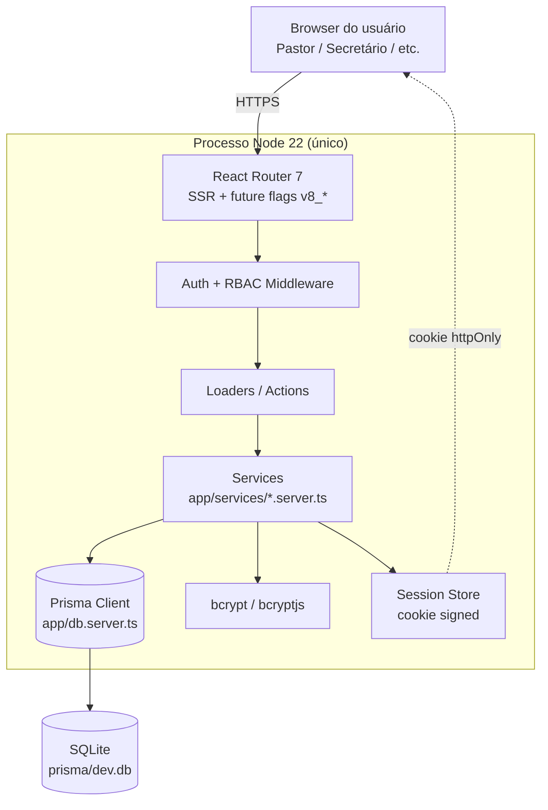

**Princípios de design:**

- **Monólito modular** — sem microsserviço. Uma única aplicação Node que serve HTML SSR + API.
- **Defense in depth** — RBAC verificado em 3 camadas (UI → loader → service).
- **Co-localização** — rotas, componentes de página e services por feature ficam próximos.
- **Sem abstração prematura** — YAGNI/KISS governa. Camadas existem onde há repetição.

---

## 2. Camadas

| Camada | Pasta | Responsabilidade | Não-responsabilidade |
|---|---|---|---|
| **Apresentação** | `app/routes/`, `app/components/` | Renderizar UI, capturar input do usuário, chamar server actions via `<Form>`. | Lógica de negócio, acesso a DB. |
| **Aplicação** (router) | `app/routes/**/*.{ts,tsx}` | Loaders (GET), Actions (POST/PUT/DELETE), Middlewares, ErrorBoundary. Conversão de `DomainError` → `Response`. | Regra de negócio pura. |
| **Domínio** (services) | `app/services/*.server.ts` | Regra de negócio, validação semântica, RBAC fina, transações Prisma. | Conhecer HTTP/Request/Response. |
| **Infra / Lib** | `app/lib/*.server.ts`, `app/db.server.ts` | Singleton do Prisma, helpers de centavos, hashing, session store, validação Zod. | Regra de negócio. |
| **Dados** | `prisma/schema.prisma`, `prisma/migrations/` | Schema do banco, migrations versionadas. | Lógica de aplicação. |

**Regra de dependência (estrita, unidirecional):**

```
Apresentação → Aplicação → Domínio → Infra → Dados
```

A camada de Apresentação **nunca** importa `db.server` diretamente. Sempre passa por service. Testes ficam ao lado da camada que testam (`app/services/membros.test.ts`, `app/routes/private/membros/$id.test.ts`).

---

## 3. Stack e justificativas

| Tecnologia | Por que | Trade-off aceito |
|---|---|---|
| **React Router 7 (SSR)** | `loader`/`action` eliminam boilerplate de API. SSR nativo, HTML inicial já tem dados (sem loading spinners desnecessários). Future flags `v8_*` ativadas (middleware, split modules). | Curva de aprendizado do data-router; lock-in em uma lib. |
| **Vite 8** | HMR rápido, build com Rollup, suporte a SSR de primeira. Padrão de fato em 2026. | Configuração `reactRouter()` + `@tailwindcss/vite` requer plugin explícito. |
| **TypeScript strict** | Tipos do Prisma + tipos gerados do React Router = segurança de tipo end-to-end. | Build mais lento (mitigado por `tsc --noEmit` paralelo). |
| **Tailwind 4** | Utility-first, sem CSS morto, theming via `@theme`. | HTML verboso (mitigado por componentes co-localizados). |
| **Prisma 7.8** | Type-safe, migration declarativa, output em `generated/prisma/` evita conflito com `node_modules`. | Queries muito complexas ainda precisam `prisma.$queryRaw`. |
| **SQLite** | Zero infra (sem Docker, sem servidor). Backup = copiar arquivo. Plausível para 1k-10k membros. **Decisão confirmada pelo usuário** no brief. | Sem concorrência multi-processo (mitigado: 1 processo Node no MVP). Sem replicação. Backup manual. |
| **bcryptjs** | Hash robusto, compatível com SSR (sem dependência nativa). | Mais lento que `bcrypt` nativo (mitigado: login é I/O-bound, ~50ms aceitável). |
| **Zod** (sugerido) | Validação runtime + type inference em uma lib. Erros estruturados (`flatten().fieldErrors`). | Bundle do cliente aumenta se importado lá (mitigado: usar em `*.server.ts` apenas). |
| **Vitest** (sugerido) | Rápido, ESM nativo, compatível com Vite/TS. | — |
| **Playwright** (sugerido) | Padrão de mercado para E2E, MCP já disponível no opencode. | — |

**Não escolhidos no MVP (registro para não voltar a avaliar):**

- ❌ Next.js (overhead de opinion, RR7 já dá o que precisamos com menos).
- ❌ tRPC (loaders/actions do RR7 já são type-safe end-to-end).
- ❌ Redis (session em cookie signed é suficiente).
- ❌ PostgreSQL (SQLite basta para 1 igreja).
- ❌ Docker Compose local (SQLite é arquivo, não precisa).
- ❌ S3/MinIO (upload de arquivos está fora do MVP; `ManutencaoAtivo.urlLaudoTecnico` aceita URL textual).

---

## 4. Modelo de dados

> **Fonte da verdade:** `prisma/schema.prisma` (12 models, 6 enums). Este capítulo é um **índice** — não duplica o schema.

### 4.1 Models por módulo

| Módulo | Models | Estado |
|---|---|---|
| **Membros** (ciclo 1) | `Membro`, `Ministerio`, `MinisterioMembro` | ✅ UI completa + service (S00–S05) |
| **Auth** (ciclo 1) | (parte de `Membro.senhaHash`, `Membro.cargo`, `Membro.email`, `Session`) | ✅ Endpoints no MVP (S00–S05) |
| **Alertas** (ciclo 1) | `Alerta`, `AlertaDestinatario` | ✅ UI básica + service (S00–S05) |
| **Configuração** (ciclo 1) | `ConfiguracaoGeral`, `ConfigAcolhimento` | ✅ Service + 1 tela ADMIN (S05) |
| **Financeiro** (ciclo 2, **fechado em produção**) | `Caixa`, `TransferenciaCaixa`, `Lancamento` | ✅ Schema + services+UI (S06-S08). Release `v0.2.0-financeiro-preview`. |
| **Relatórios Financeiros** (ciclo 4, **em andamento**) | (read-only sobre `Lancamento` — **sem novos models**) | 🟡 **Sem migration.** Schema atual cobre 100% dos requisitos. 5 services de agregação em S11-S12. |
| **Estoque + Patrimônio** (ciclo 3, **planning fechado, build deferred**) | `ItemEstoque`, `MovimentacaoEstoque`, `ManutencaoAtivo` | 🟡 **Schema pronto (ciclo 1) + planning completo (ciclo 3); build deferred para ciclo futuro** |

### 4.2 Enums (resumo)

| Enum | Valores | Onde se aplica |
|---|---|---|
| `Cargo` | ADMIN, PASTOR, SECRETARIO, DISCIPULADOR, FINANCEIRO, LIDER_MINISTERIO | RBAC. `Membro.cargo` |
| `TipoMembro` | MEMBRO_ATIVO, CONGREGADO, VISITANTE | Segmentação pastoral. `Membro.tipo` |
| `TipoLancamento` | ENTRADA, SAIDA | Movimentação financeira |
| `CategoriaLancamento` | DIZIMO, OFERTA, CAMPANHA, DESPESA_OPERACIONAL, COMPRA_ESTOQUE, MANUTENCAO, TRANSFERENCIA | Natureza do lançamento |
| `TipoItemEstoque` | CONSUMO, PATRIMONIO | Define fluxo (consumo vs. manutenção) |
| `StatusItemPatrimonio` | DISPONIVEL, EM_MANUTENCAO, BAIXADO_PERDA | Lifecycle de ativo |

### 4.3 Relacionamentos críticos

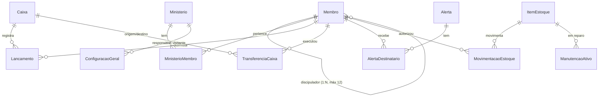

### 4.4 Decisões de modelagem

- **Auto-relacionamento** de `Membro` (discipulado) usa `onDelete: Restrict` — não permitir deletar um discipulador que ainda tem discípulos sem reatribuí-los.
- **`Lancamento.membro` é `SetNull` no delete** (RN-FIN-05: oferta anônima é permitida; dízimo órfão vira histórico sem identificação).
- **`ConfiguracaoGeral` é singleton** (sempre 1 linha). Não usar `id` autoincrement — usar `id` fixo `"singleton"` ou garantir via seed + `findFirstOrThrow` no service.
- **`AlertaDestinatario` é N:N explícita** (não usar `Alerta.destinatarios String[]`) para suportar `lido: Boolean` por destinatário.

---

## 5. Fluxo de autenticação

```mermaid
sequenceDiagram
  autonumber
  participant U as Usuário (browser)
  participant RR as React Router<br/>(server)
  participant MW as Middleware<br/>(auth)
  participant S as session.server.ts
  participant DB as Prisma + SQLite

  U->>RR: POST /login (email, senha)
  RR->>S: verifyCredentials(email, senha)
  S->>DB: membro.findUnique({ email, senhaHash })
  S->>S: bcrypt.compare(senhaPlain, hash)
  alt credenciais OK
    S->>S: createSession(userId) → sessionId
    S-->>RR: sessionId
    RR-->>U: 302 Set-Cookie: sid=<httpOnly signed>; redirect=/app
  else falha
    RR-->>U: 401 com mensagem "Credenciais inválidas"
  end

  U->>RR: GET /app/membros (Cookie: sid=...)
  RR->>MW: middleware()
  MW->>S: getSession(sid) → user
  alt sessão válida
    MW-->>RR: { user } (injetado no contexto)
    RR-->>U: 200 HTML
  else sessão inválida/expirada
    MW-->>U: 302 redirect /login
  end
```

**Pontos críticos:**

- **Sessão é cookie, não JWT.** Razão: SSR do RR7 emite cookies nativamente; mais seguro contra XSS que `localStorage`; sem necessidade de biblioteca extra. (Ver ADR-001.)
- **Hash é bcryptjs** (compat SSR). Salt rounds ≥ 10. (Ver ADR-002.)
- **Logout** invalida no servidor: `deleteSession(sid)` remove o registro da tabela `sessions` (ou store escolhido). Cookie é limpo com `Max-Age=0`.
- **TTL:** 7 dias com **sliding renewal** (cada request autenticado estende o TTL por mais 7 dias, até um teto de 30 dias absolutos). `[A CONFIRMAR]` — ver anexo do brief.

---

## 6. Fluxo de RBAC

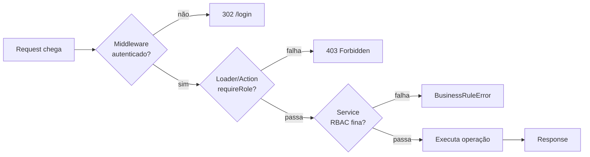

### 6.1 Matriz RBAC (resumo)

| Operação / Recurso | ADMIN | PASTOR | SECRETARIO | DISCIPULADOR | LIDER_MIN. | FINANCEIRO |
|---|:-:|:-:|:-:|:-:|:-:|:-:|
| **Membros** CRUD | ✅ | ✅ | ✅ | ✅(escopo) | ✅(escopo) | ✅ |
| **Dízimos** (RN-MEM-03) | 👁 | 👁 | 🚫 | 🚫 | 🚫 | 👁 |
| **Financeiro** CRUD | ✅ | ✅ | ✅(trava) | 🚫 | 🚫 | ✅(trava) |
| **Estoque** Consumo | ✅(autoriza) | 👁 | ✅(autoriza) | 👁 | 👁 | 👁 |
| **Estoque** Patrimônio CRUD | ✅ | 👁 | ✅ | 👁 | 👁 | 👁 |
| **Manutenção** Envio | ✅ | 👁 | ✅ | 👁 | 👁 | 👁 |
| **Manutenção** Baixa (RN-EST-05) | ✅ | 🚫 | 🚫 | 🚫 | 🚫 | 🚫 |

> 👁 = leitura / 🚫 = bloqueado / ✅ = permitido. Versão completa em `docs/DESCRIÇÃO_DOS_MODULOS.md`.

### 6.2 Implementação em 3 camadas

1. **Middleware** (`app/routes/private/_middleware.ts`): garante que há `user` no contexto. Se não, redirect.
2. **Loader/Action** (em cada rota): `requireRole(user, [...])` que lança 403 se perfil não bate.
3. **Service** (fina): checa regras de escopo — ex: `DISCIPULADOR` só edita membros onde `discipuladorId === user.id`.

---

## 7. Fluxo de Membros (CRUD + discipulado + alertas)

### 7.1 Cadastrar visitante (gera alerta)

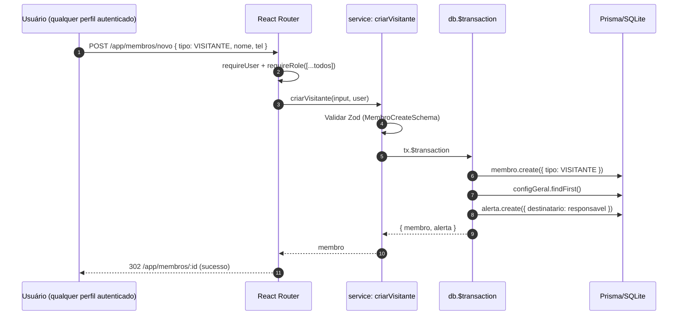

**Atômico (RN-MEM-05):** se a criação do alerta falhar, o visitante não é criado. `db.$transaction` garante.

### 7.2 Vincular discípulo a discipulador (RN-MEM-04)

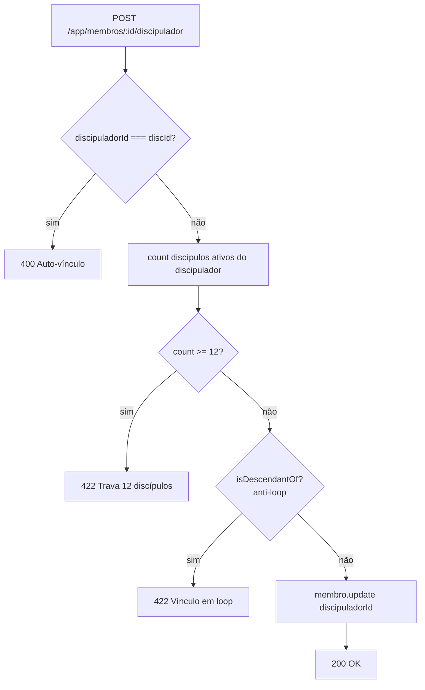

**Testes de borda obrigatórios:**

- 12 discípulos: passa
- 13º: bloqueia com mensagem clara
- A→B e B→A simultâneo: bloqueia (anti-loop)
- Vincular a si mesmo: bloqueia

### 7.3 Listagem de membros

Loader único, com filtros via `URLSearchParams`:

```
GET /app/membros?tipo=VISITANTE&ministerioId=<uuid>&discipuladorId=<uuid>&q=maria
```

Service `listMembros(filter)` retorna paginado (`page`, `pageSize`). UI tem filtros + busca textual por nome (case-insensitive, `contains`).

---

## 8. Módulo Financeiro — Arquitetura (ciclo 2)

> **Escopo do ciclo 2:** Caixas + Lançamentos + Dízimos + Ofertas + Transferências + Trava de Saldo + aba Fidelidade Financeira. 5 RNs já documentadas (`RN-FIN-01` a `RN-FIN-05`). Schema Prisma pronto desde o ciclo 1; serviços e UI a serem entregues em S06-S08.
>
> **Fonte canônica:** `brief.md` §4-§8 + RAGs `pattern-trava-saldo-service`, `pattern-transferencia-caixas`, `architecture-financeiro`, `decision-caixa-soft-delete`.

### 8.1 Camadas do módulo

Mesma arquitetura monolítica modular do MVP (RAG `architecture-monolith-modular`), com a fronteira estrita `Apresentação → Aplicação → Domínio → Infra → Dados`.

```
UI (app/components/, app/routes/app/financeiro/**)
  ↓ chama service via loader/action
Domínio (app/lib/caixas.server.ts, lancamentos.server.ts, transferencias.server.ts, finance.server.ts)
  ↓ chama helpers transversais
Infra (app/lib/rbac.server.ts, app/lib/money.server.ts, app/db/prisma.server.ts)
  ↓
Dados (prisma/schema.prisma — Caixa, TransferenciaCaixa, Lancamento)
```

**5 services no Módulo Financeiro:**

| Service | Responsabilidade | RN coberta |
|---|---|---|
| `app/lib/caixas.server.ts` | CRUD `Caixa` (listar, criar, editar, arquivar, reabrir) | RN-FIN-01 |
| `app/lib/lancamentos.server.ts` | CRUD `Lancamento` (criar, listarPorCaixa, listarPorMembro, editar descritivo) | RN-FIN-01, RN-FIN-04, RN-FIN-05 |
| `app/lib/transferencias.server.ts` | `transferirEntreCaixas` (operação composta atômica) | RN-FIN-02 |
| `app/lib/finance.server.ts` (canônico) | `assertSaldoSuficiente`, `getDizimosByMembro` (Camada 3 já pronta) | (transversal) |
| `app/lib/money.server.ts` (canônico, JÁ EXISTE) | `formatBRLFromCents`, `parseBRLToCents`, `assertNonNegative` | (transversal) |

**Rotas adicionadas (todas em `app/routes/app/financeiro/**`):**

- `financeiro._index.tsx` — dashboard (cards de saldo por caixa + indicador agregado).
- `financeiro.caixas._index.tsx` — listagem de caixas.
- `financeiro.caixas.novo.tsx` — criar caixa.
- `financeiro.caixas.$id.tsx` — extrato do caixa + arquivar.
- `financeiro.lancamentos.novo.tsx` — criar lançamento (campo Membro condicional à categoria).
- `financeiro.transferencias._index.tsx` — listagem (somente leitura).
- `financeiro.transferencias.novo.tsx` — form de transferência.

### 8.2 Fluxo crítico 1: Criar Dízimo (entrada vinculada a Membro)

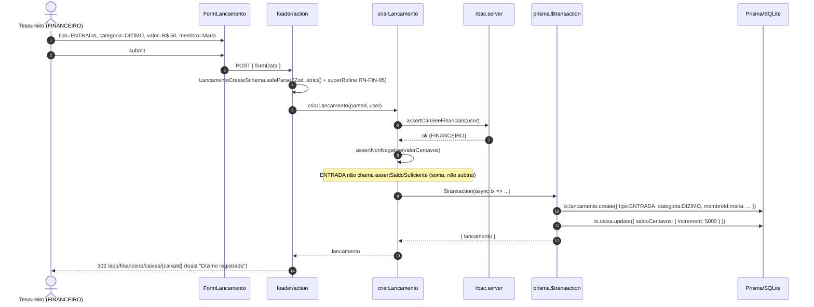

**Pontos críticos:**

- **RN-FIN-05:** `LancamentoCreateSchema.superRefine` rejeita `DIZIMO` sem `membroId` (400). `OFERTA` aceita `membroId = null`. Outras categorias exigem `membroId = null`.
- **RBAC:** FINANCEIRO, ADMIN, PASTOR, SECRETARIO podem criar (matriz §4.8 do brief). DISCIPULADOR e LIDER_MINISTERIO recebem 403 em todas as 3 camadas.
- **Trava:** ENTRADA não passa por `assertSaldoSuficiente` (soma, não subtrai), mas passa por checagem de `caixa.ativo === false` (proposta pendente — RAG `decision-caixa-soft-delete`).

### 8.3 Fluxo crítico 2: Transferência entre Caixas (RN-FIN-02 + RN-FIN-04 atômico)

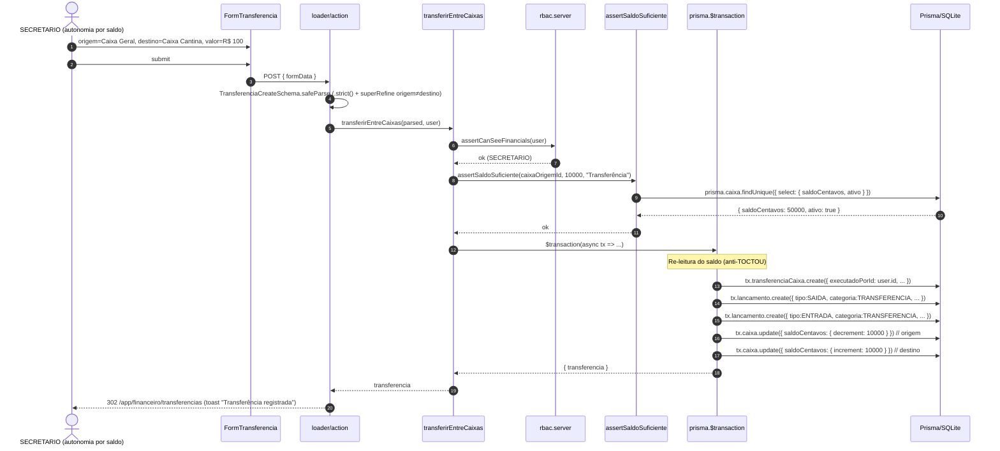

**Pontos críticos:**

- **5 mutações atômicas em 1 `$transaction`** — sem atomicidade, sistema fica inconsistente.
- **Modelagem híbrida (1+2):** 1 `TransferenciaCaixa` (imutável, auditoria, RN-FIN-02) + 2 `Lancamento` espelho (extrato, reconciliação). Decisão **confirmada** no discovery (brief §5.2).
- **`categoria: TRANSFERENCIA` é exclusiva** do `transferirEntreCaixas`. `criarLancamento` rejeita essa categoria. Teste estático cobre (`grep`).
- **Carimbo do operador:** `executadoPorId: user.id` (nunca do form).
- **Re-leitura do saldo dentro do `$transaction`** (anti-TOCTOU) — não confia na leitura do helper.
- **RBAC:** todos os perfis com `canSeeFinancials` (ADMIN, PASTOR, FINANCEIRO, SECRETARIO) podem transferir, **desde que com saldo** (RN-FIN-03). DISCIPULADOR e LIDER_MINISTERIO recebem 403.

Ver RAG `pattern-transferencia-caixas` para detalhes completos e exemplos de teste.

### 8.4 Fluxo crítico 3: Trava de Saldo (RN-FIN-04)

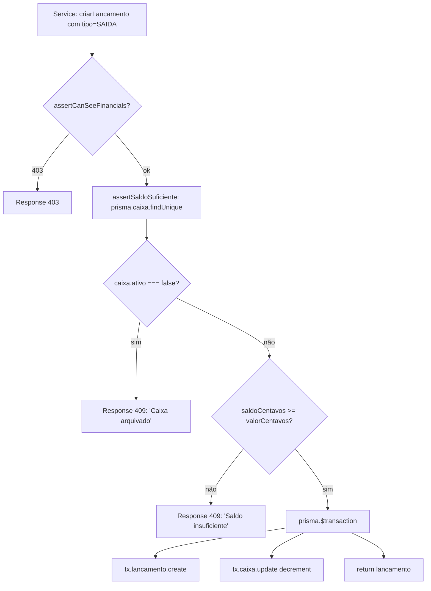

**Ordem inegociável:** `assertCan*` (RBAC) → `assertSaldoSuficiente` (RN-FIN-04) → `$transaction`. Ver RAG `pattern-trava-saldo-service` para código completo e exemplos de teste.

### 8.5 Fluxo crítico 4: Aba "Fidelidade Financeira" (RN-MEM-03)

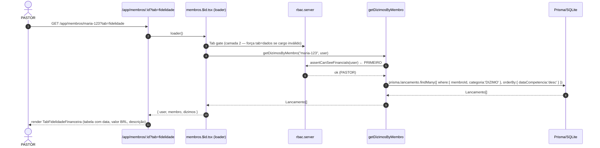

**3 camadas de defesa (já prontas no ciclo 1, basta substituir placeholder):**

1. **UI:** `<Can allow={['ADMIN','PASTOR','FINANCEIRO']}>` esconde a aba.
2. **Loader:** se `tab=fidelidade` na URL mas cargo inválido, redireciona para `tab=dados` (RN-MEM-03).
3. **Service:** `getDizimosByMembro` chama `assertCanSeeFinancials` **PRIMEIRO** (Camada 3 — única mandatória).

**Sub-tarefa do ciclo 2 (brief §4.6):** substituir o placeholder do `TabFidelidadeFinanceira` por tabela de dízimos + card de resumo mensal/anual. Service já está pronto (basta descomentar a query real — linha 67 do `app/lib/finance.server.ts`).

### 8.6 Modelagem dos 3 models do Financeiro

| Model | Campos principais | Relacionamentos | Status |
|---|---|---|---|
| **`Caixa`** | `id`, `nome @unique`, `saldoCentavos Int @default(0)`, `ativo Boolean?` (proposta pendente), timestamps | `lancamentos[]`, `origemTransf[]`, `destinoTransf[]` | Schema ✅. Service + UI no ciclo 2. |
| **`TransferenciaCaixa`** | `id`, `valorCentavos Int`, `caixaOrigemId`, `caixaDestinoId`, `executadoPorId`, `dataHora` | `caixaOrigem` (Restrict), `caixaDestino` (Restrict), `executadoPor` (Restrict) | Schema ✅. Service + UI no ciclo 2. |
| **`Lancamento`** | `id`, `tipo (ENTRADA/SAIDA)`, `categoria (7 valores)`, `valorCentavos Int`, `caixaId`, `membroId?` (SetNull), `dataCompetencia`, `descricao`, timestamps | `caixa` (Restrict), `membro` (SetNull — RN-FIN-05) | Schema ✅. Service + UI no ciclo 2. |

**Decisão de modelagem pendente (formalização na Fase 2):** adicionar `Caixa.ativo: Boolean @default(true)` para soft-delete (arquivamento). Ver RAG `decision-caixa-soft-delete` (status: `pending`).

**Mapa de `categoria` em `Lancamento`:**

| Categoria | Tipo esperado | `membroId` | RN |
|---|---|---|---|
| `DIZIMO` | `ENTRADA` | **obrigatório** | RN-FIN-05 |
| `OFERTA` | `ENTRADA` | opcional (anônimo) | RN-FIN-05 |
| `CAMPANHA` | `ENTRADA` | `null` | — |
| `DESPESA_OPERACIONAL` | `SAIDA` | `null` | RN-FIN-04 (trava) |
| `COMPRA_ESTOQUE` | `SAIDA` | `null` | RN-FIN-04 (trava) |
| `MANUTENCAO` | `SAIDA` | `null` | RN-FIN-04 (trava) |
| `TRANSFERENCIA` | ambos | `null` | **Exclusivo** do `transferirEntreCaixas` (RN-FIN-02) |

### 8.7 RBAC fina do Módulo Financeiro (matriz completa, brief §4.8)

| Operação \ Perfil | ADMIN | PASTOR | FINANCEIRO | SECRETARIO | DISCIPULADOR | LIDER_MIN. |
|------------------|:-----:|:------:|:----------:|:----------:|:------------:|:----------:|
| Ver dashboard `/app/financeiro` | ✅ | ✅ | ✅ | ✅ | 🚫 | 🚫 |
| Criar / arquivar Caixa | ✅ | ✅ | ✅ | 🚫 | 🚫 | 🚫 |
| Lançar DIZIMO (com membro) | ✅ | ✅ | ✅ | ✅ | 🚫 | 🚫 |
| Lançar OFERTA (anônima) | ✅ | ✅ | ✅ | ✅ | 🚫 | 🚫 |
| Lançar DESPESA / SAIDA (com trava) | ✅ | ✅ | ✅ | ✅ | 🚫 | 🚫 |
| Transferir entre Caixas | ✅ | ✅ | ✅ | ✅ | 🚫 | 🚫 |
| Ver aba Fidelidade Financeira (RN-MEM-03) | ✅ | ✅ | ✅ | 🚫 | 🚫 | 🚫 |
| Ver extrato de Caixa alheio | ✅ | ✅ | ✅ | ✅ | 🚫 | 🚫 |

> **Defesa em 3 camadas obrigatória:** `assertCanSeeFinancials` (Camada 3) bloqueia perfis não-financeiros. UI esconde, loader checa, service barra. Discipulador e Líder de Ministério são **BLOQUEADOS** em todo o módulo.

### 8.8 Decisões macro do Módulo Financeiro (consolidadas)

- **Monólito modular** (RAG `architecture-monolith-modular`): sem microsserviço, sem message broker. Decisão herdada.
- **Camada 3 (service) é a única segurança real** (RAG `pattern-3-layer-rbac`): trava de saldo e RBAC moram no service.
- **Centavos `Int`** (RAG `convention-monetary-values`): nunca `Float`, nunca `Decimal`. Helpers em `app/lib/money.server.ts`.
- **TDD + JSDoc obrigatórios** (v6.2.0+): nenhuma função pública sem teste falhando antes e sem JSDoc completo.
- **Modelagem de transferência híbrida (1+2)** (brief §5.2): 1 `TransferenciaCaixa` (auditoria) + 2 `Lancamento` espelho (extrato) em `$transaction` atômico. **Confirmada no discovery.**
- **Caixas seed = só Geral** (brief §5.1): primeiro Caixa vem do `prisma/seed.ts` (idempotente). Demais sob demanda.
- **RBAC criar/arquivar Caixa = ADMIN+PASTOR+FINANCEIRO** (brief §5.3): `SECRETARIO` opera dentro, não estrutura. **Confirmada no discovery.**
- **`Caixa.ativo: Boolean @default(true)`** (proposta pendente): soft-delete. RAG `decision-caixa-soft-delete` (status `pending`). Formalização na Fase 2.

### 8.9 Limites conhecidos do Módulo Financeiro

| Limite | Onde | Mitigação |
|---|---|---|
| **SQLite single-writer** | `dev.db` | 1 processo Node + `$transaction` atômico. Postgres futuro é mudança aditiva. |
| **Sem auditoria de leitura** (LGPD art. 37) | `getDizimosByMembro` lê sem registrar quem viu | Backlog (não ciclo 2). |
| **Sem gateway de pagamento** | não há Pix/cartão | Brief §8 — não-objetivo. Reconciliação manual. |
| **Sem multi-moeda** | apenas BRL | `Int` cobre até R$ 21M por caixa. Backlog. |
| **Sem upload de comprovantes** | `Lancamento.descricao` é textual | Brief §8 — não-objetivo. Backlog (S3/MinIO). |
| **Sem relatório PDF/Excel** | exportação manual | Brief §8 — não-objetivo. |
| **Sem aprovação multi-nível para saídas grandes** | trava de saldo é o único gate | RN-FIN-03 é autonomia por saldo, sem "aprovação do pastor" como portão extra. |
| **Volumetria: 1 Caixa pode ter 1k+ lançamentos/mês** | extrato fica lento | Paginador + filtro por período. Índice `(caixaId, dataCompetencia DESC)` se virar gargalo. |
| **Caixa arquivado tem saldo congelado** | saldo histórico preservado | Correto e desejável — dinheiro "guardado" no extrato. |

### 8.10 Próximos passos (S06+)

1. **S06 — Caixa + Lançamento (Sprint 1):** CRUD básico, dashboard de saldos, RAG `pattern-trava-saldo-service` implementado em `criarLancamento`.
2. **S07 — Transferência + Trava saldo em SAIDA (Sprint 2):** RAG `pattern-transferencia-caixas` implementado, E2E de bypass.
3. **S08 — Fidelidade Financeira + RBAC fina (Sprint 3):** substituir placeholder do `TabFidelidadeFinanceira`, testes E2E de bypass (RN-MEM-03).
4. **S09+ (backlog) — Reconciliação semanal, relatórios, multi-moeda, gateway de pagamento.**

> **Definition of Done (herdado do MVP + adaptado):** cobertura ≥ 85% global, **100% em services** (`caixas`, `lancamentos`, `transferencias`), 0 vuln critical/high, `planning-reviewer` ≥ 70, LGPD compliant, 12 testes de borda do brief §7.3 **todos verdes**, métrica macro (brief §7.1) cumprida.

---

## 9. Módulo Estoque + Patrimônio — Arquitetura (ciclo 3)

> **Escopo do ciclo 3:** Estoque de Consumo (almoxarifado com trava de quantidade) + Patrimônio (state machine de status + manutenção externa + baixa por perda). 5 RNs já documentadas (`RN-EST-01` a `RN-EST-05`). Schema Prisma pronto desde o ciclo 1; serviços e UI a serem entregues em S11–S12.
>
> **Fonte canônica:** `brief.md` §4-§8 + RAGs `pattern-estoque-trava-quantidade`, `pattern-patrimonio-status-state-machine`, `pattern-manutencao-alerta-manual`, `convention-tipos-item-estoque`.

### 9.1 Camadas do módulo

Mesma arquitetura monolítica modular dos ciclos anteriores (RAG `architecture-monolith-modular`), com a fronteira estrita `Apresentação → Aplicação → Domínio → Infra → Dados`.

```
UI (app/components/, app/routes/app/estoque/**)
  ↓ chama service via loader/action
Domínio (app/lib/estoque.server.ts, movimentacao.server.ts, patrimonio.server.ts, manutencao.server.ts)
  ↓ chama helpers transversais
Infra (app/lib/rbac.server.ts, app/db/prisma.server.ts)
  ↓
Dados (prisma/schema.prisma — ItemEstoque, MovimentacaoEstoque, ManutencaoAtivo)
```

**4 services no Módulo Estoque + Patrimônio:**

| Service | Responsabilidade | RN coberta |
|---|---|---|
| `app/lib/estoque.server.ts` | CRUD `ItemEstoque` (listar, criar, editar, arquivar) + `assertSaldoQuantidade` (Camada 3) | RN-EST-01, RN-EST-02 |
| `app/lib/movimentacao.server.ts` | `criarMovimentacao` (ENTRADA/SAIDA com trava de quantidade) | RN-EST-02 |
| `app/lib/patrimonio.server.ts` | State machine helpers (`assertTransicaoPatrimonioValida`, `assertItemIsPatrimonio`, `assertItemIsConsumo`) | RN-EST-01, RN-EST-03, RN-EST-05 |
| `app/lib/manutencao.server.ts` | `enviarParaManutencao`, `retornarDeManutencao`, `baixaPorPerda`, `verificarAlertaManutencaoSemPrazo` (RN-EST-04) | RN-EST-03, RN-EST-04, RN-EST-05 |

**Rotas adicionadas (todas em `app/routes/app/estoque/**`):**

- `estoque._index.tsx` — listagem unificada com filtros (tipo, status, busca textual).
- `estoque.novo.tsx` — criar item (form com `discriminatedUnion` Zod, campos condicionais por tipo).
- `estoque.$id.tsx` — detalhe do item + 2 abas (Movimentações para CONSUMO / Manutenções para PATRIMONIO).
- `estoque.$id.editar.tsx` — editar item.
- `estoque.$id.movimentacao.nova.tsx` — registrar movimentação (toggle ENTRADA/SAIDA, `nomeRetirante` obrigatório para saída).
- `estoque.$id.manutencao.nova.tsx` — enviar patrimônio para manutenção externa.
- `estoque.$id.manutencao.retorno.tsx` — registrar retorno de manutenção.
- `estoque.$id.baixa-perda.tsx` — baixa por perda (apenas ADMIN, RN-EST-05).

### 9.2 Diagrama de models

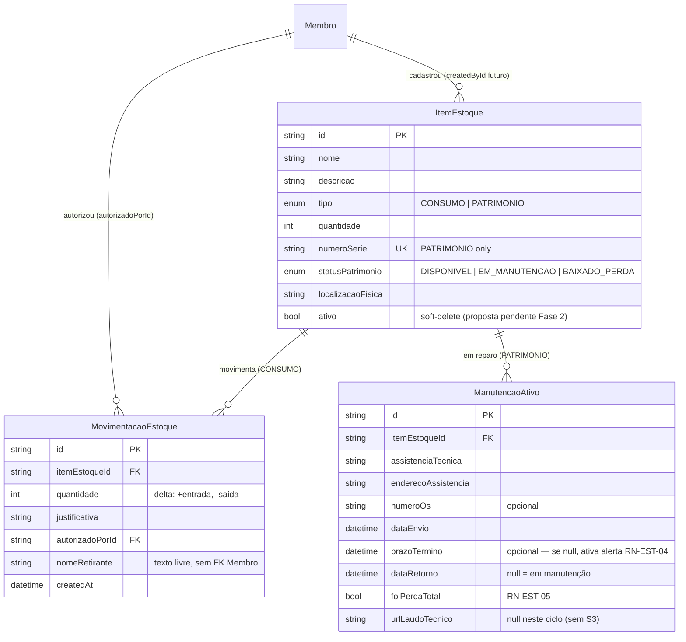

### 9.3 Fluxo crítico 1: Cadastro de Item (discriminatedUnion Zod)

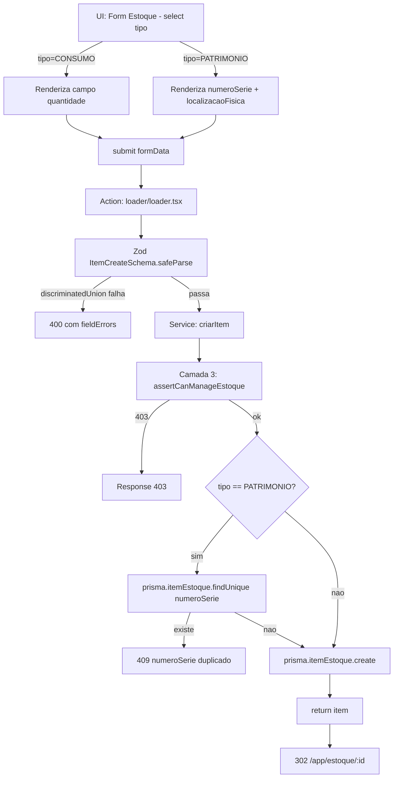

**Pontos críticos:**

- **Discriminated union Zod** rejeita payload inconsistente em tempo de validação (Camada 2), antes do DB. Ex: `tipo: PATRIMONIO` sem `numeroSerie` → 400 imediato.
- **Campos condicionais na UI** evitam erro humano: `numeroSerie` aparece só para PATRIMONIO; `quantidade` em input livre só para CONSUMO.
- **RBAC:** ADMIN, PASTOR, SECRETARIO podem criar. DISCIPULADOR, LIDER_MINISTERIO, FINANCEIRO recebem 403 nas 3 camadas.

### 9.4 Fluxo crítico 2: Movimentação de Consumo (RN-EST-02 + trava de quantidade)

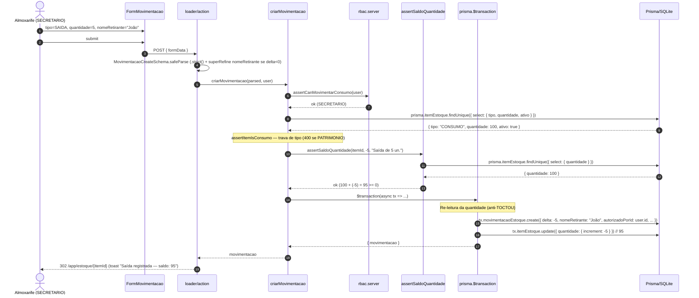

**Pontos críticos:**

- **RN-EST-02:** `nomeRetirante` é **obrigatório** para saída (delta<0). Schema Zod rejeita string vazia com 400.
- **Trava de quantidade** (helper `assertSaldoQuantidade`): rejeita saída que deixaria `quantidade < 0` com 409.
- **Trava de tipo:** movimentação em item `PATRIMONIO` → 400 (helper `assertItemIsConsumo`).
- **RBAC:** apenas ADMIN, PASTOR, SECRETARIO podem criar movimentação. Demais perfis (DISCIPULADOR, LIDER_MINISTERIO, FINANCEIRO) recebem 403 em todas as 3 camadas.
- **Atomicidade:** movimentação + update de quantidade em `$transaction` único. Anti-TOCTOU: re-leitura dentro do `$transaction`.

### 9.5 Fluxo crítico 3: State Machine de Patrimônio (RN-EST-01/03/05)

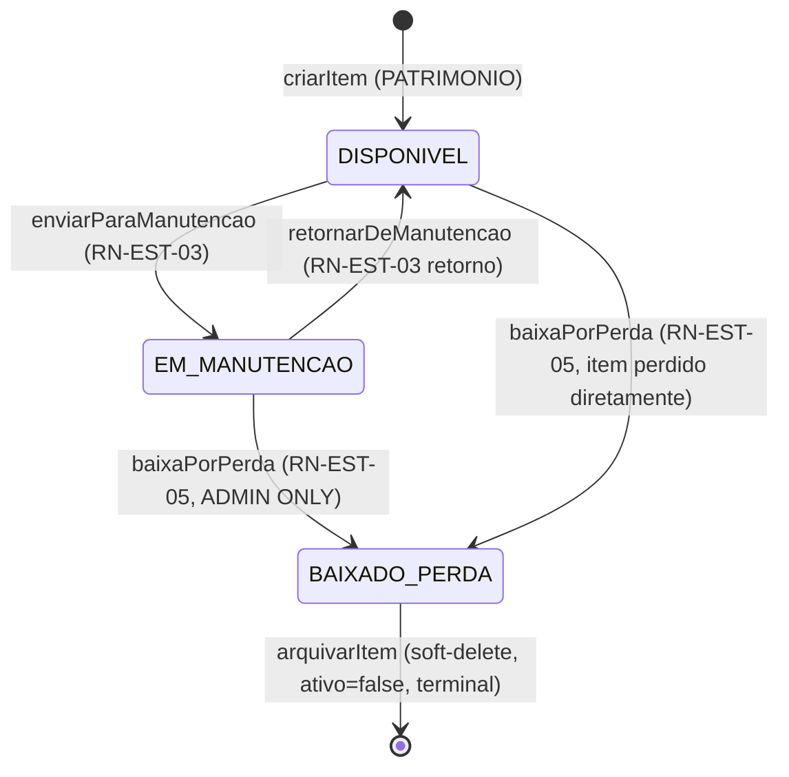

**Matriz de transições válidas (helper `assertTransicaoPatrimonioValida`):**

| Origem | → Destino | Operação | RBAC (Camada 3) | RN |
|---|---|---|---|---|
| (novo) | `DISPONIVEL` | `criarItem({ tipo: PATRIMONIO })` | ADMIN, PASTOR, SECRETARIO | RN-EST-01 |
| `DISPONIVEL` | `EM_MANUTENCAO` | `enviarParaManutencao(itemId)` | ADMIN, PASTOR, SECRETARIO | RN-EST-03 |
| `EM_MANUTENCAO` | `DISPONIVEL` | `retornarDeManutencao(manutencaoId)` | ADMIN, PASTOR, SECRETARIO | RN-EST-03 |
| `EM_MANUTENCAO` | `BAIXADO_PERDA` | `baixaPorPerda(manutencaoId, motivo)` | **ADMIN ONLY** | RN-EST-05 |
| `DISPONIVEL` | `BAIXADO_PERDA` | `baixaPorPerda(itemId, motivo)` (sem manutenção prévia) | **ADMIN ONLY** | RN-EST-05 |
| `BAIXADO_PERDA` | (nenhum) | — | — | Terminal: nenhuma transição sai |

> **Diferencial crítico:** Baixa por Perda é única operação restrita a ADMIN (RN-EST-05), mesmo que SECRETARIO/PASTOR possam tudo o mais no módulo.

### 9.6 Fluxo crítico 4: Envio para Manutenção Externa (RN-EST-03)

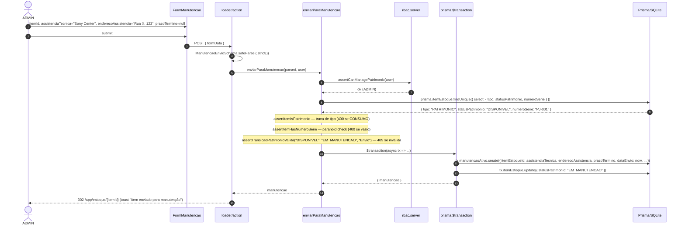

**Pontos críticos:**

- **Trava de tipo (400):** item `CONSUMO` não vai para manutenção externa.
- **Trava de transição (409):** item já em `EM_MANUTENCAO` não pode ser enviado de novo.
- **`assistenciaTecnica` + `enderecoAssistencia` obrigatórios** (RN-EST-03); `numeroOs` e `prazoTermino` opcionais.
- **`prazoTermino` null** ativa o gatilho de alerta manual (RN-EST-04 — ver §9.7).

### 9.7 Fluxo crítico 5: Alerta On-Consulta para Manutenção sem Prazo (RN-EST-04)

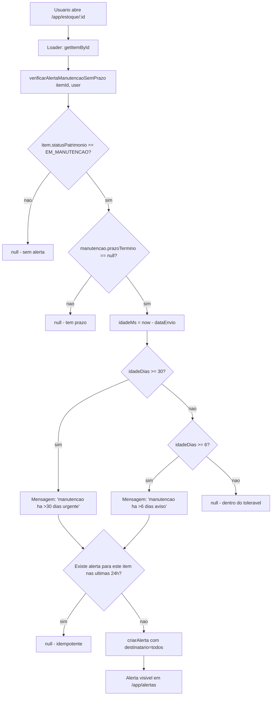

**Pontos críticos:**

- **Decisão de design (brief §5.1):** sem cron job no MVP. Gatilho on-consulta (loader) com idempotência 24h.
- **Rotas quentes:** `/app/estoque/:id` (detalhe do item) + `/app/alertas` (central de alertas, visitação frequente).
- **Helper é idempotente:** janela de 24h impede spam mesmo com múltiplas consultas.
- **Escalonamento:** 6 dias (aviso) / 30 dias (urgente, mensagem强调 "Atualize o status").
- **`.catch` no loader:** falha na criação do alerta NÃO bloqueia render do item (efeito colateral, não pode quebrar UX principal).
- **Trade-off aceito:** se ninguém consultar a rota `/app/estoque/:id` por 60 dias, alerta não dispara. Mitigação parcial: rota `/app/alertas` também checa.

### 9.8 Fluxo crítico 6: Baixa por Perda Total (RN-EST-05, ADMIN ONLY)

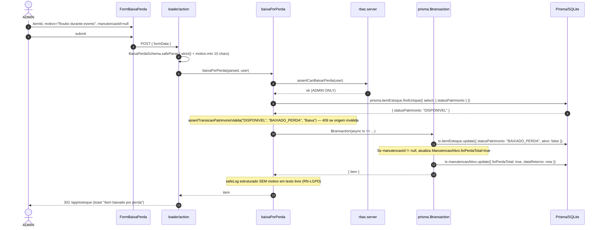

**Pontos críticos:**

- **RBAC mais restritiva do módulo:** apenas ADMIN (RN-EST-05). SECRETARIO recebe 403 mesmo que possa tudo o mais.
- **Motivo textual obrigatório** (mínimo 10 caracteres). Upload de laudo (`urlLaudoTecnico`) backlog (sem S3/MinIO).
- **`BAIXADO_PERDA` é terminal:** item não volta para `DISPONIVEL`. Para "recuperar" item perdido, criar item NOVO.
- **Soft-delete:** `ativo = false` some da listagem padrão; histórico de manutenções/movimentações preservado.
- **Audit log SEM motivo:** `motivo` pode conter texto sensível (ex: "Pastor X desviou verba"). Log estruturado guarda apenas metadados (itemId, executadoPorId, timestamp).

### 9.9 RBAC fina do Módulo Estoque + Patrimônio (matriz completa, brief §4.9)

| Operação \ Perfil | ADMIN | PASTOR | SECRETARIO | FINANCEIRO | LIDER_MIN. | DISCIPULADOR |
|---|:-:|:-:|:-:|:-:|:-:|:-:|
| Ver listagem e detalhe | ✅ | ✅ | ✅ | 👁 | 👁 | 👁 |
| Criar/editar Item (qualquer tipo) | ✅ | ✅ | ✅ | 🚫 | 🚫 | 🚫 |
| Arquivar Item | ✅ | ✅ | ✅ | 🚫 | 🚫 | 🚫 |
| Movimentação ENTRADA (Consumo) | ✅ | ✅ | ✅ | 🚫 | 🚫 | 🚫 |
| Movimentação SAÍDA (Consumo, com nomeRetirante) | ✅ | ✅ | ✅ | 🚫 | 🚫 | 🚫 |
| Enviar para Manutenção | ✅ | ✅ | ✅ | 🚫 | 🚫 | 🚫 |
| Retornar de Manutenção | ✅ | ✅ | ✅ | 🚫 | 🚫 | 🚫 |
| **Baixa por Perda Total (RN-EST-05)** | ✅ | 🚫 | 🚫 | 🚫 | 🚫 | 🚫 |
| Ver aba Manutenções (detalhe) | ✅ | ✅ | ✅ | 👁 | 👁 | 👁 |

> 👁 = leitura / 🚫 = bloqueado / ✅ = permitido. Defesa em 3 camadas obrigatória: `<Can>` (UI) + `assertCan*` (loader) + `assertCan*` (service).

### 9.10 Decisões macro do Módulo Estoque + Patrimônio (consolidadas)

- **Monólito modular** (RAG `architecture-monolith-modular`): sem microsserviço, sem message broker. Decisão herdada.
- **Camada 3 (service) é a única segurança real** (RAG `pattern-3-layer-rbac`): trava de quantidade, RBAC fina e state machine moram no service.
- **Discriminated union Zod** (RAG `convention-tipos-item-estoque`): payload inconsistente (`tipo: PATRIMONIO` sem `numeroSerie`) rejeitado em tempo de validação (Camada 2).
- **`BAIXADO_PERDA` é terminal** (state machine): nenhuma transição sai dele. Decisão consciente (auditoria de patrimônio).
- **`nomeRetirante` é texto livre, sem FK Membro** (RN-EST-02): reduz atrito operacional, elimina PII cadastrada. Decisão consciente (brief §6.2).
- **Sem cron job no MVP** (RN-EST-04): alerta on-consulta com idempotência 24h. Decisão consciente (brief §5.1).
- **Sem upload S3/MinIO no MVP** (RN-EST-05 adaptado): `motivo` textual, `urlLaudoTecnico` permanece `null`. Decisão consciente (brief §5.2).
- **`ItemEstoque.ativo: Boolean @default(true)`** (proposta pendente Fase 2): soft-delete. Espelha `Caixa.ativo` do ciclo 2 (já aprovada). Helpers já antecipam (`assertSaldoQuantidade` checa `ativo === false`).
- **`ManutencaoAtivo.custoCentavos: Int?`** (custo de manutenção): segue RAG `convention-monetary-values` quando aplicável.

### 9.11 Limites conhecidos do Módulo Estoque + Patrimônio

| Limite | Onde | Mitigação |
|---|---|---|
| **Sem cron job** | RN-EST-04 alerta | On-consulta via loader (gated + idempotente 24h). Migração para cron em ciclo futuro. |
| **Sem upload de laudo** | RN-EST-05 anexo | `motivo` textual. Migração para S3/MinIO em ciclo futuro. |
| **Sem upload de foto** | Patrimônio sem foto | `localizacaoFisica` textual. Migração para S3/MinIO em ciclo futuro. |
| **Sem sincronização Estoque ↔ Financeiro** | Compra de estoque e manutenção | Lançamento manual pelo `FINANCEIRO` (enum `CategoriaLancamento.COMPRA_ESTOQUE` e `MANUTENCAO` já existem). Integração automática backlog. |
| **Sem inventário físico mobile** | Reconciliação de estoque | Script `pnpm audit:estoque` (backlog). |
| **Sem relatório de curva ABC** | Consumo por item | Loader básico + filtros. Relatório avançado backlog. |
| **`BAIXADO_PERDA` é terminal** | Item perdido não volta | Decisão consciente (auditoria). Para "recuperar" item perdido, criar item NOVO. |
| **SQLite single-writer** | `dev.db` | 1 processo Node + `$transaction` atômico. Postgres futuro é mudança aditiva. |

### 9.12 Próximos passos (S11+)

1. **S11 — Estoque Consumo + Movimentação (Sprint 1):** CRUD básico de `ItemEstoque` (CONSUMO), `criarMovimentacao` com trava, RAG `pattern-estoque-trava-quantidade` implementado.
2. **S12 — Patrimônio + Manutenção + Baixa (Sprint 2):** CRUD `ItemEstoque` (PATRIMONIO), state machine completa (`enviarParaManutencao`, `retornarDeManutencao`, `baixaPorPerda`), alerta on-consulta (RN-EST-04), E2E de bypass para RN-EST-05 (SECRETARIO → 403).
3. **S13+ (backlog):** cron real para alertas, upload S3/MinIO (laudos + fotos), inventário físico mobile, sincronização automática Estoque ↔ Financeiro.

> **Definition of Done (herdado do MVP + ciclo 2 + ciclo 3):** cobertura ≥ 85% global, **100% em services** (`estoque`, `movimentacao`, `patrimonio`, `manutencao`), 0 vuln critical/high, `planning-reviewer` ≥ 70, LGPD compliant, 17 testes de borda do brief §7.3 **todos verdes**, métrica macro (brief §7.1) cumprida.

---

## 10. Relatórios Financeiros — Arquitetura (ciclo 4)

> **Escopo do ciclo 4 (2026-06-20+):** 5 páginas de leitura agregada em `/app/financeiro/relatorios/**` (Hub + DRE + Balancete + Fluxo de Caixa + Customizado) que transformam o repositório bruto de `Lancamento` em inteligência pastoral/tesouraria. **Camada read-only sobre o Módulo Financeiro do ciclo 2** — sem migration, sem novos models Prisma, sem novas regras de negócio. As 5 RNs já existentes (`RN-FIN-01` a `05`) são suficientes.
>
> **Fonte canônica:** [`brief-relatorios.md`](../../brief-relatorios.md) §4 (Escopo), §5 (Decisões), §6 (Restrições), §7 (Sucesso), §8 (Não-objetivos). Brief aprovado pelo usuário em 2026-06-20T15:35Z.
>
> **RAGs específicos:** `pattern-relatorios-aggregations` (high, novo) + `convention-relatorios-csv-export` (high, novo) + `architecture-financeiro` (high, herdado) + `pattern-trava-saldo-service` (critical, herdado).

### 10.1 Camadas do módulo

Mesma arquitetura monolítica modular dos ciclos anteriores (RAG `architecture-monolith-modular`), com a fronteira estrita `Apresentação → Aplicação → Domínio → Infra → Dados`. **Destaques do ciclo 4:**

```
UI (app/components/FiltrosPeriodo.tsx, app/components/KpiCard.tsx,
    app/components/icons/FinanceIcons.tsx,
    app/routes/app/financeiro/relatorios/**)
  ↓ chama service via loader/action
Domínio (app/lib/relatorios.server.ts — 5 services read-only,
         app/lib/relatorios-csv.server.ts — export CSV)
  ↓ chama helpers transversais
Infra (app/lib/rbac.server.ts — RELATORIOS_CARGOS + assertCanSeeRelatorios,
       app/lib/money.server.ts — formatBRLFromCents / parseBRLToCents,
       app/db/prisma.server.ts — singleton)
  ↓
Dados (prisma/schema.prisma — Lancamento, CategoriaLancamento, TipoLancamento)
```

**Diferença conceitual vs. ciclos anteriores:** Relatórios é **read-only** (sem `$transaction`, sem mutação de saldo). A ordem inegociável `assertCan* → assertSaldoSuficiente → $transaction` (RAG `pattern-trava-saldo-service`) **simplifica para** `assertCanSeeRelatorios → groupBy / findMany`. Não há trava de saldo porque não há mutação.

**6 services no Módulo Relatórios Financeiros:**

| Service | Responsabilidade | Camada RBAC |
|---|---|---|
| `app/lib/relatorios.server.ts` → `getDRE` | Agrega entradas e saídas por categoria em 1 período | `assertCanSeeRelatorios` |
| `app/lib/relatorios.server.ts` → `getBalanceteMensal` | 4 KPIs (Saldo Anterior / Entradas / Saídas / Saldo Atual) + tabela por categoria | `assertCanSeeRelatorios` |
| `app/lib/relatorios.server.ts` → `getFluxoCaixa` | Série temporal de 12 meses (findMany + Map em memória) | `assertCanSeeRelatorios` |
| `app/lib/relatorios.server.ts` → `getRelatorioCustomizado` | Query filtrada (6 dimensões) + paginação | `assertCanSeeRelatorios` |
| `app/lib/relatorios.server.ts` → `exportarLancamentosCSV` | Server-side CSV download (delega para `relatorios-csv.server.ts`) | `assertCanSeeRelatorios` |
| `app/lib/relatorios-csv.server.ts` | Helpers `escapeCsvField`, `formatValorCsv`, `montarCabecalhoCsv`, `exportarLancamentosCSV` | (re-exporta do `relatorios.server.ts`) |

**Separação de responsabilidade:** `relatorios-csv.server.ts` é separado de `relatorios.server.ts` (regra de responsabilidade única). CSV é formato de export, não regra de negócio. Helpers podem ser reusados em futuros exports (PDF, JSON).

**Rotas adicionadas (todas em `app/routes/app/financeiro/relatorios/**`):**

- `relatorios._index.tsx` — Hub (grid 2×2 com 4 cards + bloco secundário "Relatório de Transparência 2024" placeholder).
- `relatorios.dre.tsx` — DRE (3 KPIs + grid Entradas por Tipo + Saídas por Categoria).
- `relatorios.balancete.tsx` — Balancete Mensal (4 KPIs + tabela Resumo + side card Distribuição de Saídas).
- `relatorios.fluxo-caixa.tsx` — Fluxo de Caixa (4 KPIs + SVG line chart Entradas/Saídas/Saldo).
- `relatorios.customizado.tsx` — Customizado (filtros + KPIs + tabela paginada + action de export CSV).

**Componentes compartilhados:**

- `<FiltrosPeriodo />` — 4 presets (7d / 30d / mês corrente / ano) + botão "Personalizado" que abre 2 inputs `<input type="date">`.
- `<KpiCard />` — card com ícone colorido + badge opcional + valor + subtítulo. Reutilizado em todos os 5 relatórios.

### 10.2 Diagrama de fluxo macro (ciclo 4)

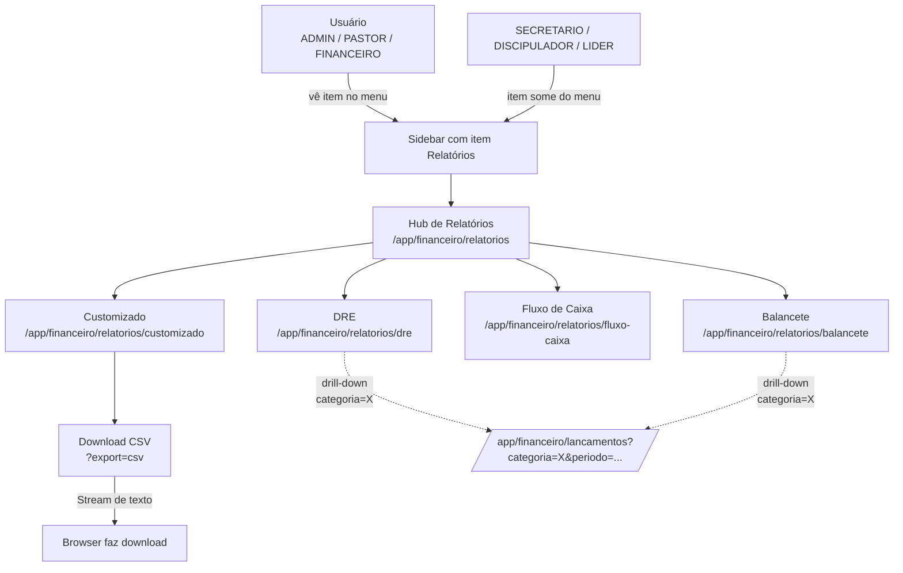

### 10.3 Fluxo crítico 1: Camadas em sequência (defense in depth em 3 camadas)

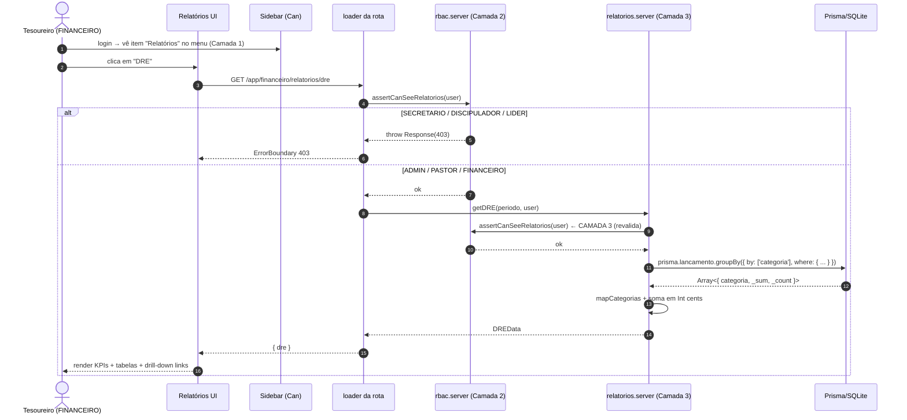

**Pontos críticos:**

- **Camada 1 (UI):** item "Relatórios" some do menu para SECRETARIO. UX apenas, não segurança.
- **Camada 2 (loader):** `assertCanSeeRelatorios(user)` ANTES de qualquer I/O. Se bypass via URL direta (`SECRETARIO` digita `/app/financeiro/relatorios`), 403 imediato.
- **Camada 3 (service):** `assertCanSeeRelatorios(user)` PRIMEIRO no service. Se loader for refatorado e esquecer Camada 2, Camada 3 ainda protege.
- **Soma em `Int` cents:** `_sum.valorCentavos` retorna `number | null`. Reduce em `Int` evita `0.1 + 0.2 !== 0.3`.
- **Filtro de data semi-aberto `[gte, lt)`:** meses consecutivos não se sobrepõem no boundary (decision §2.2 do `pattern-relatorios-aggregations`).

### 10.4 Fluxo crítico 2: DRE (Demonstrativo de Resultado)

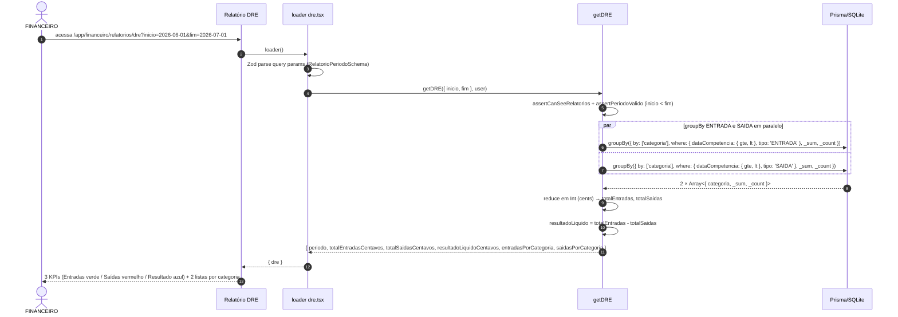

**Pontos críticos:**

- **2 queries em paralelo** com `Promise.all`: ~70% mais rápido que sequencial.
- **`mapCategorias` arredonda percentual** para 2 casas (evita `99.99%` por precisão de Float).
- **Resultado Líquido = Entradas - Saídas** (sinal negativo = déficit, renderizar com badge "Déficit" em vermelho).
- **Edge case (período vazio):** retorna `{ 0, 0, 0, [], [] }` (sem null/undefined). Teste cobre.

### 10.5 Fluxo crítico 3: Fluxo de Caixa (série temporal, 12 meses)

```mermaid
sequenceDiagram
  autonumber
  actor U as PASTOR
  participant FE as Fluxo de Caixa UI
  participant LD as loader fluxo-caixa.tsx
  participant SVC as getFluxoCaixa
  participant DB as Prisma/SQLite

  U->>FE: acessa /app/financeiro/relatorios/fluxo-caixa (default: ano corrente)
  FE->>LD: loader()
  LD->>SVC: getFluxoCaixa({ inicio: 2026-01-01, fim: 2027-01-01 }, user)

  SVC->>SVC: assertCanSeeRelatorios + assertPeriodoValido

  SVC->>DB: prisma.lancamento.findMany({ where: { dataCompetencia: { gte, lt } }, select: { dataCompetencia, tipo, valorCentavos } })
  DB-->>SVC: Lancamento[] (~5.000 linhas para 1 ano típico)

  SVC->>SVC: agrupa por mês (YYYY-MM) em Map
  Note over SVC: Acumula saldo (running total)<br/>12 pontos para 1 ano

  SVC-->>LD: { serie: [{ mes: '2026-01', entradasCentavos, saidasCentavos, saldoCentavos }, ...], saldoAcumuladoCentavos }
  LD-->>FE: { fluxoCaixa }
  FE-->>U: 4 KPIs + SVG line chart Entradas (verde) / Saídas (vermelho) / Saldo (azul tracejado)
```

**Pontos críticos:**

- **Limitação SQLite:** `groupBy` em SQLite não suporta `strftime('%Y-%m', dataCompetencia)` (Prisma). Workaround: `findMany` + `Map` em memória. Para volume esperado (até 5k lançamentos/mês × 12 = 60k linhas), viável. Acima disso, migrar para `prisma.$queryRaw` (ciclo 6+).
- **Saldo acumulado (running total):** cada ponto = `saldoAnterior + entradasMes - saidasMes`. Renderiza curva ascendente/descendente.
- **SVG inline line chart:** path Bezier com 3 séries (Entradas verde sólido, Saídas vermelho sólido, Saldo azul tracejado). Sem `recharts`/`d3` (decisão YAGNI, brief §5.5).

### 10.6 Fluxo crítico 4: Export CSV (RFC 4180 + BOM UTF-8 + `;`)

```mermaid
sequenceDiagram
  autonumber
  actor U as ADMIN
  participant FE as Customizado UI
  participant ACT as action customizado.tsx
  participant SVC as exportarLancamentosCSV
  participant CSV as relatorios-csv.server
  participant DB as Prisma/SQLite

  U->>FE: ajusta filtros + clica "Exportar CSV"
  FE->>ACT: GET /app/financeiro/relatorios/customizado?export=csv&...
  ACT->>ACT: Zod parse filtros (RelatorioCustomizadoFiltrosSchema)
  ACT->>SVC: exportarLancamentosCSV(filtros, user)

  SVC->>SVC: assertCanSeeRelatorios (Camada 3)
  SVC->>CSV: delega para relatorios-csv.server.ts
  CSV->>DB: prisma.lancamento.findMany({ where: <filtros>, orderBy: { dataCompetencia: 'desc' }, include: { caixa, membro } })
  DB-->>CSV: Lancamento[]

  CSV->>CSV: para cada Lancamento:<br/>formata data (YYYY-MM-DD)<br/>escapa descrição (RFC 4180)<br/>formata valor (-123.45 para SAÍDA)<br/>junta com ';'

  CSV->>CSV: monta string final:<br/>BOM () + header + linhas + CRLF
  CSV-->>SVC: string CSV completa
  SVC-->>ACT: string CSV

  ACT-->>FE: new Response(csv, { headers: { Content-Type: 'text/csv; charset=utf-8', Content-Disposition: 'attachment; filename="igreja-conect-relatorio-YYYY-MM-DD.csv"', Cache-Control: 'no-store' } })
  FE-->>U: download automático
```

**Pontos críticos:**

- **BOM UTF-8** (`EF BB BF`): sem ele, Excel pt-BR abre com Latin-1 e corrompe acentos (teste cobre 3 primeiros bytes).
- **Separador `;`:** vírgula conflita com decimal pt-BR.
- **SAÍDA com sinal negativo:** `-123.45` permite fórmula `=SUM(F:F)` no Sheets para cálculo líquido.
- **Escape RFC 4180:** aspas internas viram `""` (teste cobre descrição `Dízimo "Maria"`).
- **`Cache-Control: no-store`:** LGPD + dado financeiro sensível. Browser/proxy/CDN nunca podem cachear.
- **`assertCanSeeRelatorios` na Camada 3:** mesmo se action esquecer Camada 2, service protege.

**Limitação de escala:** 1.280 registros em < 500ms (teste de performance, brief §7.3). Acima disso, migrar para streaming chunked.

### 10.7 RBAC fina do Módulo Relatórios Financeiros (matriz completa)

| Operação \ Perfil | ADMIN | PASTOR | SECRETARIO | FINANCEIRO | LIDER_MIN. | DISCIPULADOR |
|---|:-:|:-:|:-:|:-:|:-:|:-:|
| Ver item "Relatórios" no Sidebar | ✅ | ✅ | 🚫 | ✅ | 🚫 | 🚫 |
| Acessar Hub (`/app/financeiro/relatorios`) | ✅ | ✅ | 🚫 | ✅ | 🚫 | 🚫 |
| DRE (`/app/financeiro/relatorios/dre`) | ✅ | ✅ | 🚫 | ✅ | 🚫 | 🚫 |
| Balancete (`/app/financeiro/relatorios/balancete`) | ✅ | ✅ | 🚫 | ✅ | 🚫 | 🚫 |
| Fluxo de Caixa (`/app/financeiro/relatorios/fluxo-caixa`) | ✅ | ✅ | 🚫 | ✅ | 🚫 | 🚫 |
| Customizado (`/app/financeiro/relatorios/customizado`) | ✅ | ✅ | 🚫 | ✅ | 🚫 | 🚫 |
| Export CSV (`?export=csv`) | ✅ | ✅ | 🚫 | ✅ | 🚫 | 🚫 |
| Drill-down (navegar para `/app/financeiro/lancamentos`) | ✅ | ✅ | n/a | ✅ | n/a | n/a |

> 👁 = leitura / 🚫 = bloqueado / ✅ = permitido / n/a = sem acesso upstream. **SECRETARIO BLOQUEADO** em todas as 5 rotas (decisão de produto, brief §3.1, §5.3). Não é falha de segurança — é regra de prestação de contas estruturada ser responsabilidade pastoral-administrativa (PASTOR/FINANCEIRO/ADMIN).

### 10.8 Decisões macro do Módulo Relatórios Financeiros (consolidadas)

- **Sem migration:** schema Prisma do ciclo 1 cobre 100% dos requisitos (model `Lancamento` + 2 enums). Nenhum `prisma migrate dev` neste ciclo.
- **Sem novas RNs:** as 5 RNs já existentes (`RN-FIN-01` a `05`) são suficientes. Relatórios **lê** o que já foi escrito.
- **`RELATORIOS_CARGOS = ["ADMIN", "PASTOR", "FINANCEIRO"]`:** SECRETARIO bloqueado (decisão §5.3 do brief). Justificativa: prestação de contas estruturada é responsabilidade pastoral-administrativa (LGPD Art. 6°, III — princípio da necessidade).
- **`Int` em centavos (sempre):** toda agregação opera em cents; formatação BRL só na borda UI. Estende `convention-monetary-values`.
- **Filtros semi-abertos `[gte, lt)`:** meses consecutivos não se sobrepõem no boundary. Estende `pattern-trava-saldo-service`.
- **CSV em vez de PDF:** sem dependências externas com peso considerável (`pdfkit`/`puppeteer` ~250MB). PDF diferido para ciclo 6+. Estende `brief §5.2`.
- **SVG inline em vez de lib de ícones:** ~25 SVGs em `app/components/icons/FinanceIcons.tsx`. Sem `lucide-react`. Estende `brief §5.5`.
- **Placeholders em vez de features fake:** cards "Projeção" e filtro "Status" renderizam placeholder cinza. Implementar "fake" seria mentir para o usuário. Estende `brief §5.6, §5.7`.
- **Drill-down via query string:** `<Link>` com `?categoria=X&periodo=...` navega para `/app/financeiro/lancamentos` (rota pendente, brief §5.4). Decisão final na Fase 3 (Design).
- **Defense in depth em 3 camadas:** UI (`<Can>` no Sidebar) + loader (`assertCanSeeRelatorios`) + service (`assertCanSeeRelatorios` PRIMEIRO). Estende `pattern-3-layer-rbac`.

### 10.9 Limites conhecidos do Módulo Relatórios Financeiros

| Limite | Onde | Mitigação |
|---|---|---|
| **Sem PDF** | Export no Customizado | CSV cobre o caso real (Sheets pivot). PDF em ciclo 6+. |
| **Sem projeção real** | Cards "Projeção" no Balancete e Fluxo | Placeholder cinza. Depende de `ContaPagar` (ciclo 6+). |
| **Sem status** | Filtro no Customizado | `<select disabled>`. Depende de refactor de schema. |
| **Sem drill-down de gráfico** | SVG line chart no Fluxo | Apenas clique em linhas de tabela é navegável. |
| **Sem cache** | Toda geração on-demand | Sem Redis. Para volume muito alto (> 100k lançamentos), `$queryRaw` em ciclo futuro. |
| **Fuso do servidor** | `dataCompetencia` filtrada em `Date` local | Assumir fuso único. Migração para UTC puro em ciclo futuro. |
| **Fluxo de Caixa não escala para > 24 meses** | `findMany` + `Map` em memória | Limitar UI a 24 meses. Migrar para `prisma.$queryRaw` com `strftime` em ciclo 6+. |
| **SQLite single-writer** | `dev.db` | 1 processo Node + queries read-only (sem `$transaction`). Postgres futuro é mudança aditiva. |
| **Rota `/app/financeiro/lancamentos` não existe** | Drill-down pendente | Decisão na Fase 3 (Design): criar nova rota (S13) ou redirecionar para `/app/financeiro/caixas/:id` com query params. |

### 10.10 Próximos passos (S11+)

- **S11 (Backend foundation):** `relatorios.server.ts` (5 services) + `rbac.server.ts` (`RELATORIOS_CARGOS` + `assertCanSeeRelatorios`) + `relatorios-csv.server.ts` (helpers RFC 4180) + testes unitários (TDD obrigatório — gate 100% em `relatorios.server.ts`).
- **S12 (Frontend + integração):** 5 rotas + 2 componentes compartilhados + Sidebar atualizada + ~25 ícones SVG + testes E2E.
- **S13 (Drill-down, condicional):** apenas se a Fase 3 (Design) confirmar que a rota `/app/financeiro/lancamentos` precisa ser criada para suportar o drill-down (decisão §5.4 do brief). Hoje já existem `/app/financeiro/caixas/:id` (extrato) e `/app/financeiro/lancamentos/novo` (form), mas não há listagem geral.

---

## 11. Tratamento de centavos

**Convenção:** todos os valores monetários são `Int` em **centavos** no banco e em trânsito. Conversão só na borda (formulário de input, renderização).

```ts
// app/lib/centavos.ts (helpers puros)

/** @description Converte reais (number) para centavos (Int) com arredondamento bancário. */
export const reaisParaCentavos = (reais: number): number =>
  Math.round(reais * 100);

/** @description Converte centavos (Int) para reais (number). */
export const centavosParaReais = (centavos: number): number =>
  centavos / 100;

/** @description Formata centavos como moeda brasileira (BRL). */
export const formatBRL = (centavos: number): string =>
  new Intl.NumberFormat("pt-BR", { style: "currency", currency: "BRL" })
    .format(centavos / 100);
```

**Regras:**

- ❌ Nunca `Float`/`Decimal` para dinheiro.
- ❌ Nunca comparar floats (`0.1 + 0.2 !== 0.3`).
- ✅ Schemas Zod para `valorReais: number` no input, service converte para `valorCentavos: int` antes de gravar.
- ✅ Display sempre via `formatBRL`.

**Campos no schema que seguem esta convenção:**

- `Caixa.saldoCentavos`
- `TransferenciaCaixa.valorCentavos`
- `Lancamento.valorCentavos`

---

## 12. Sessão e segurança

### 12.1 Decisões

| Aspecto | Decisão | Justificativa |
|---|---|---|
| **Tipo** | Session cookie (não JWT) | SSR nativo, sem lib extra, mais seguro contra XSS |
| **Storage** | Cookie assinado com `SESSION_SECRET` + registro no DB | Permite invalidação server-side (logout, ban) |
| **TTL** | 7 dias sliding, teto 30 dias absolutos | Equilíbrio entre UX e segurança |
| **Flags** | `httpOnly`, `secure` (prod), `sameSite=lax` | Mitiga XSS, CSRF, MITM |
| **Hash** | bcryptjs, salt rounds ≥ 10 | Padrão da indústria, compat SSR |
| **Renovação** | A cada request autenticado: `expira = now + 7d` (até 30d abs) | Usuário ativo não é deslogado; inativo expira |
| **Invalidação** | `deleteSession(sid)` no DB + cookie `Max-Age=0` | Logout robusto |

### 12.2 Estrutura da session (sugestão)

```ts
// app/lib/session.server.ts
type SessionData = {
  userId: string;
  cargo: Cargo;
  expiresAt: number;     // unix ms
  absoluteExpiresAt: number;
};
```

> Tabela `Session` ainda não foi adicionada ao schema — o backend agent da Fase 5 deve adicioná-la como primeira migration (ver §18.1 Pendências).

### 12.3 Cenários de segurança

- **Cookie theft (XSS):** impossível ler via JS (httpOnly). Mitigação adicional: CSP.
- **Cookie theft (CSRF):** `sameSite=lax` + checagem de `Origin` em mutações (RR7 já valida form actions com mesma origem por padrão).
- **Session fixation:** regenerar `sessionId` após login bem-sucedido.
- **Brute force:** rate limit no endpoint `/login` (futuro, pode ser middleware simples em memória no MVP).

---

## 13. Decisões de design registradas (ADRs)

> **Formato:** ADR mínimo (Architecture Decision Record) — Contexto, Alternativas, Decisão, Consequências.

### ADR-001 — Session cookie httpOnly em vez de JWT

- **Contexto:** Auth necessária no MVP, sem dependência externa, com SSR.
- **Alternativas:**
  1. JWT em `localStorage` — popular, mas vulnerável a XSS.
  2. JWT em cookie httpOnly — seguro mas adiciona complexidade de refresh.
  3. **Session cookie httpOnly + store server-side** — escolhido.
- **Decisão:** Session cookie httpOnly, com registro de sessão no DB para permitir invalidação.
- **Consequências:**
  - ✅ Logout server-side funciona.
  - ✅ Mais seguro contra XSS.
  - ❌ 1 lookup a mais no DB por request autenticado (mitigável com cache em memória).
  - ❌ Não escala para mobile app (mas mobile está fora do MVP).

### ADR-002 — bcryptjs em vez de bcrypt nativo

- **Contexto:** SSR do React Router 7 roda em Node, mas o build pode ser implantado em ambientes sem binários nativos (ex: Vercel Edge, Cloudflare Workers — não usados no MVP, mas previstos).
- **Alternativas:**
  1. `bcrypt` (nativo) — mais rápido, mas requer compilação em deploy.
  2. `argon2` — mais moderno, mas ecossistema menor.
  3. **bcryptjs** (JS puro) — escolhido.
- **Decisão:** `bcryptjs` com salt rounds = 10.
- **Consequências:**
  - ✅ Zero dependência nativa. Build portátil.
  - ❌ ~30% mais lento que `bcrypt` nativo (50ms vs 30ms em login — irrelevante).
  - ❌ Não usar para hashing em massa (criptomoeda, etc.) — irrelevante para o domínio.

### ADR-003 — Zod para validação de payload

- **Contexto:** Toda mutation precisa validar input. Alternativa: TypeScript guards manuais.
- **Alternativas:**
  1. Type guards manuais — verboso, sem inferência de tipo.
  2. Valibot — bundle menor, API similar.
  3. TypeBox — JSON Schema puro, mais complexo.
  4. **Zod** — escolhido. `[A CONFIRMAR]`
- **Decisão pendente:** Zod é a recomendação, mas pode ser revisitado na Fase 3 (Design). Razão: ecossistema maduro, `z.infer<>` casa com TS, mensagens de erro localizáveis.

### ADR-004 — Monólito modular em vez de microsserviços

- **Contexto:** Igreja local, escala horizontal não é prioridade. Time pequeno (1-3 devs).
- **Alternativas:**
  1. Microsserviços por módulo (auth, membros, financeiro) — over-engineering.
  2. **Monólito modular** — escolhido.
  3. Serverless (Vercel Functions) — viável, mas adiciona vendor lock-in.
- **Decisão:** Monólito único Node, com módulos internos bem delimitados em pastas. Se algum dia precisar拆分, `app/services/financeiro.server.ts` é um边界 natural.

### ADR-005 — Singleton do Prisma Client via globalThis

- **Contexto:** Vite HMR recarrega módulos a cada save, recriando instâncias do Prisma Client e esgotando conexões.
- **Alternativas:**
  1. Singleton em módulo — padrão.
  2. **Singleton em `globalThis` em dev, novo em prod** — escolhido.
  3. Pool de conexões externo — overkill para SQLite.
- **Decisão:** Padrão clássico do Prisma + Next.js, adaptado para RR7.

---

## 14. Como o sistema escala (do MVP para 3 módulos)

> **Roadmap de alto nível** — não inclui datas, apenas sequência.

```mermaid
gantt
    title Roadmap Igreja Conect (alto nível)
    dateFormat YYYY-MM-DD
    section Ciclo 1 (FECHADO 2026-06-13)
    MVP Auth + Membros + Discipulado + Alertas + Acolhimento (S00-S05) :done, mvp, 2026-06-12, 30d
    section Ciclo 2 (FECHADO 2026-06-19)
    Financeiro — caixas + lançamentos (S06) :done, fin1, after mvp, 14d
    Financeiro — transferência + trava saldo (S07) :done, fin2, after fin1, 14d
    Financeiro — Fidelidade Financeira + RBAC fina (S08) :done, fin3, after fin2, 14d
    Cleanup Financeiro (S09-S10) :done, fin4, after fin3, 14d
    section Ciclo 3 (EM ANDAMENTO 2026-06-19+)
    Estoque — consumo + movimentação (S11) :active, est1, after fin4, 14d
    Estoque — patrimônio + manutenção + baixa (S12) :est2, after est1, 21d
    section Ciclo 4+ (backlog)
    Cron de alertas + relatórios :cron, after est2, 14d
    Upload S3/MinIO (laudos + fotos) :s3, after est2, 14d
    Inventário físico mobile :inv, after s3, 21d
```

**Critérios para mover de sprint (definition of done herdado do MVP + ciclo 2 + ciclo 3):**

1. Cobertura ≥ 85% global, **100% em services de regra de negócio**.
2. Zero vuln critical/high.
3. LGPD compliant.
4. `planning-reviewer` score ≥ 70.
5. **Métrica macro do ciclo 3 (brief §7.1):** SECRETARIO cadastra 5 pacotes de papel A4, registra saída de 2 com `nomeRetirante`, ADMIN abre detalhe e vê histórico completo.
6. **Métrica macro do ciclo 2 (brief §7.1, regressão):** FINANCEIRO lança dízimo de Membro X no Caixa Geral em < 2 min, PASTOR vê na aba Fidelidade.

**Módulos por status (jun/2026):**

| Módulo | Status | Bloqueios |
|---|---|---|
| **Membros** (RN-MEM-01 a 06) | ✅ Completo (ciclo 1, S00-S05) | — |
| **Alertas** (RN-MEM-05) | ✅ Completo (ciclo 1) | — |
| **Acolhimento** (RN-MEM-05) | ✅ Completo (ciclo 1) | — |
| **Financeiro** (RN-FIN-01 a 05) | ✅ **Completo (ciclo 2, S06-S10)** | `gate: all-of passed` 2026-06-19. Decisão `Caixa.ativo` já aprovada. |
| **Estoque — Consumo** (RN-EST-01, 02) | 🟡 **Em andamento (ciclo 3, S11)** | Schema ✅. Services + UI em S11. Decisão `ItemEstoque.ativo` pendente (Fase 2). |
| **Estoque — Patrimônio** (RN-EST-01, 03, 05) | 🟡 **Em andamento (ciclo 3, S12)** | Schema ✅. Services + UI em S12. Baixa por perda: ADMIN only (RN-EST-05). Upload de laudo backlog. |
| **Manutenção + Alerta** (RN-EST-04) | 🟡 **Em andamento (ciclo 3, S12)** | Alerta on-consulta (sem cron job, decisão do brief §5.1). Scheduler real backlog. |

---

## 15. Dependências externas

**MVP (atual):**

| Dependência | Tipo | Por que |
|---|---|---|
| **Prisma** (ORM) | lib npm | Padrão do projeto. |
| **bcryptjs** (hash) | lib npm | ADR-002. |
| **zod** (validação) | lib npm `[A CONFIRMAR]` | ADR-003. |
| **better-sqlite3** (driver) | lib npm | Usado pelo `@prisma/adapter-better-sqlite3`. |

**Fora do MVP (registro):**

- ❌ Gateway de pagamento (Pix, cartão) — fora de escopo.
- ❌ S3/MinIO — upload de laudos e fotos está fora do MVP.
- ❌ Serviço de e-mail (SMTP/SES) — sem notificação por e-mail no MVP.
- ❌ Serviço de push (FCM/APNs) — sem mobile nativo.
- ❌ Provedor de analytics — sem tracking de terceiros (LGPD).
- ❌ WAF / CDN / Rate limit externo — não necessário para 1 igreja.
- ❌ Monitoramento externo (Sentry, Datadog) — pode entrar em sprint futura; por ora, logs do Node.

---

## 16. Performance e limites

| Limite | Onde | Mitigação |
|---|---|---|
| **SQLite single-writer** | `dev.db` (e prod no MVP) | Aceitável para 1 igreja. Se virar gargalo, migrar para Postgres é mudança aditiva (Prisma abstrai). |
| **Bundle SSR** | Tudo roda em Node | Code splitting por rota já é nativo no RR7. Tailwind 4 faz purge automático. |
| **Sem cache distribuído** | Sem Redis | Cache apenas em memória (ex: sessão Prisma cacheada no request). Para MVP, OK. |
| **Sem CDN** | Assets servidos pelo Node | Para 1 igreja local, irrelevante. |
| **Sem rate limit externo** | Login é o endpoint mais sensível | Implementar in-memory rate limit no middleware `/login` (5 tentativas / 15min / IP). `[A CONFIRMAR]`. |
| **Sem índices explícitos** | Tabelas vão crescer | Índices em FK + campos de busca (nome, email, tipo) devem ser adicionados em migration pós-MVP se profiling mostrar lentidão. |
| **Sessão em cookie** | 1 request autenticado = 1 SELECT no DB | Mitigável: cachear `user` em `Map<sessionId, User>` com TTL curto. `[A CONFIRMAR]`. |

**Métricas de referência (targets):**

- Login: < 200ms p95 (rede local + bcrypt + 1 SELECT).
- Listar membros (1k): < 300ms p95.
- Cadastrar membro + alerta: < 200ms p95 (transação simples).

---

## 17. Testes

### 17.1 Estratégia em 3 camadas

| Camada | Ferramenta | O que testa | Localização |
|---|---|---|---|
| **Unit** | Vitest `[A CONFIRMAR]` | Services puros, helpers (centavos, validação), componentes puros | `app/**/*.test.ts` co-localizado |
| **Integração** | Vitest + Prisma test DB | Services com DB real (SQLite in-memory ou arquivo de teste) | `app/**/*.integration.test.ts` |
| **E2E** | Playwright (MCP) | Fluxos críticos: login, RBAC (RN-MEM-03), trava 12 (RN-MEM-04), alerta visitante (RN-MEM-05) | `e2e/**/*.spec.ts` |

### 17.2 Cobertura mínima

- **Gate do phase 5:** 85% global, 100% em services de regra de negócio.
- **Críticos sem cobertura:** nenhuma PR é mergeada (gate).

### 17.3 Casos obrigatórios (do brief)

- **RN-MEM-02:** schema/service rejeita `cpf` (teste de integração).
- **RN-MEM-03:** bypass via URL retorna 403 em 3 perfis (E2E).
- **RN-MEM-04:** 12 passa, 13 falha (boundary test).
- **RN-MEM-05:** cadastrar visitante gera alerta (integration).
- **RN-MEM-06:** nenhum job de promoção automática existe (assertion estática).

---

## 18. Diagramas de sequência adicionais

### 18.1 Login bem-sucedido

```mermaid
sequenceDiagram
  actor U as Pastor
  participant FE as Login form
  participant RR as React Router
  participant SVC as service.login
  participant BCRYPT as bcryptjs
  participant DB as Prisma

  U->>FE: preenche email + senha
  U->>FE: submit
  FE->>RR: POST /login
  RR->>SVC: login(email, senha)
  SVC->>DB: membro.findUnique({ email })
  DB-->>SVC: membro
  SVC->>BCRYPT: compare(senha, membro.senhaHash)
  BCRYPT-->>SVC: true
  SVC->>SVC: createSession(membro.id)
  SVC-->>RR: { sessionId, user }
  RR-->>FE: 302 Set-Cookie sid=...; Location=/app
  FE-->>U: redireciona
```

### 18.2 Cadastrar visitante (RN-MEM-05)

```mermaid
sequenceDiagram
  actor U as Secretário
  participant FE as Form Membro (UI)
  participant RR as React Router
  participant SVC as service.criarMembro
  participant TX as db.$transaction
  participant DB as SQLite

  U->>FE: preenche tipo=VISITANTE
  U->>FE: submit
  FE->>RR: POST /app/membros
  RR->>SVC: criarMembro(input, user)
  SVC->>SVC: Zod parse
  SVC->>TX: $transaction
  TX->>DB: membro.create({ tipo: VISITANTE })
  TX->>DB: configGeral.findFirst()
  alt tem responsavelMembroId
    TX->>DB: alerta.create({ destinatario: { membroId } })
  else tem responsavelMinisterioId
    TX->>DB: alerta.create({ destinatarios: { todos membros do ministério } })
  end
  TX-->>SVC: ok
  SVC-->>RR: membro
  RR-->>FE: 302 /app/membros/:id
```

### 18.3 Tentar acessar aba dízimos sem permissão (RN-MEM-03)

```mermaid
sequenceDiagram
  actor U as Discipulador
  participant FE as Browser
  participant RR as React Router
  participant MW as Middleware
  participant SVC as service.getDizimos

  U->>FE: GET /app/membros/:id?tab=fidelidade
  FE->>RR: request
  RR->>MW: middleware()
  MW-->>RR: { user: Discipulador }
  RR->>RR: requireRole(user, [ADMIN, PASTOR, FINANCEIRO])
  RR-->>FE: 403 Forbidden
  alt bypass via API
    U->>RR: GET /app/membros/:id/api/dizimos
    RR->>SVC: getDizimos(membroId, user)
    SVC-->>RR: ForbiddenError
    RR-->>FE: 403 Forbidden
  end
```

> **Defesa em 3 camadas comprovada por este diagrama:** UI esconde a aba, loader checa role, service checa role. O atacante tem que burlar 3 coisas.

---

## 19. Pendências para próximos agentes

> Lista de itens **fora do escopo desta task** que precisam ser endereçados em fases seguintes.

### 19.1 Backend agent (Fase 5)

- [ ] Criar `prisma/seed.ts` com `upsert` do primeiro ADMIN (idempotente).
- [ ] Adicionar model `Session` ao schema (id, userId, expiresAt, absoluteExpiresAt).
- [ ] Implementar `app/lib/session.server.ts` (create/get/delete/renew).
- [ ] Implementar `app/lib/auth.server.ts` (requireUser, requireRole, verifyCredentials).
- [ ] Implementar `app/services/membros.server.ts` com TDD.
- [ ] Implementar `app/services/alertas.server.ts` com TDD.

### 19.2 Designer agent (Fase 3)

- [ ] Wireframes de baixa fidelidade: login, lista de membros, ficha do membro, central de alertas, config de acolhimento.
- [ ] Diagrama de navegação entre rotas autenticadas.

### 19.3 RAG-curator (Fase 1 auxiliar)

- [ ] `.harness/RAG/cpf-validation.md` — por que não coletamos.
- [ ] `.harness/RAG/session-security.md` — checklist de session cookie.
- [ ] `.harness/RAG/rbac-pattern.md` — padrão defense in depth aplicado a 3 camadas.
- [ ] `.harness/RAG/prisma-rr7-setup.md` — gotchas do Prisma 7 com React Router 7 SSR.

### 19.4 Decisions pendentes (`[A CONFIRMAR]`)

1. **Zod vs Valibot vs TypeBox** (ADR-003) — sugestão: Zod.
2. **TTL exato da sessão** — sugestão: 7d sliding, teto 30d abs.
3. **Política de senha** — sugestão: ≥ 8 chars, sem forçar complexidade.
4. **Comportamento da aba Fidelidade Financeira** para perfis bloqueados — sugestão: não renderizar (RN-MEM-03).
5. **Rate limit no `/login`** — sugestão: 5 tentativas / 15min / IP.
6. **Resolução de `app/prisma.config.ts` vs `prisma.config.ts`** (duplicata detectada) — ver abaixo.

---

## 20. Anexo: Decisões pendentes detectadas

Durante a Fase 1, identifiquei os seguintes pontos que precisam de decisão explícita antes de começar a Fase 5:

### 20.1 Duplicata `prisma.config.ts`

Existem **dois** arquivos de configuração do Prisma:

- `prisma.config.ts` (raiz) — gerado automaticamente pelo `prisma init`, parece "oficial".
- `app/prisma.config.ts` — criado manualmente em algum momento, mas o RR7 normalmente lê o da raiz.

**Recomendação:** manter apenas `prisma.config.ts` na raiz. O `app/prisma.config.ts` deve ser deletado pelo backend agent. **Decisão pendente** — confirmar com o usuário.

### 20.2 Model `Session` não existe no schema

Sem `Session`, não há como invalidar sessões no servidor (logout real). **Decisão:** adicionar como migration inicial. Estrutura sugerida:

```prisma
model Session {
  id                  String   @id @default(uuid())
  membroId            String
  membro              Membro   @relation(fields: [membroId], references: [id], onDelete: Cascade)
  expiresAt           DateTime
  absoluteExpiresAt   DateTime
  createdAt           DateTime @default(now())
  updatedAt           DateTime @updatedAt
  @@map("sessions")
}
```

> Isso requer adicionar o back-relation em `Membro.alter()`. **Decisão pendente** — confirmar com o designer.

### 20.3 `app/routes.ts` tem `index("app/api/auth/login.ts")` como rota

A linha 11 do `app/routes.ts` atual tem:

```ts
// api
index("app/api/auth/login.ts"),
```

Isso faz com que `app/api/auth/login.ts` seja tratado como rota (substituindo `/` na raiz), o que **não** é o desejado para um endpoint de API. **Recomendação:** remover essa linha e tratar endpoints de API fora do `routes.ts` (usar `app/api/` como servidor HTTP independente, ou usar RR7 resource routes com `.` no nome).

---

## Próxima revisão

- **Quando:** ao final de cada sprint (Fase 5 completa) ou quando schema/fluxos mudarem.
- **Por quem:** `documenter` agent, acionado pelo orchestrator.
- **O que atualizar:** especialmente a §12 (ADRs), §13 (Roadmap) e §19 (Pendências) — os itens 19.1-19.3 devem sumir à medida que forem resolvidos.
